# A-Guy-educ/A-Guy Architecture

**Last updated:** 2026-05-31
**Stack:** Next.js 15 (App Router) · Payload CMS 3.x · MongoDB/Mongoose · Gemini LLM · TypeScript strict

---

## Table of Contents

1. [System Overview](#system-overview)
2. [Directory Structure](#directory-structure)
3. [Request / Data Flow](#request--data-flow)
4. [Module Breakdown](#module-breakdown)
   - [src/app — Next.js App Router](#srcapp--nextjs-app-router)
   - [src/server — Payload CMS Backend](#srcserver--payload-cms-backend)
   - [src/infra — Shared Infrastructure](#srcinfra--shared-infrastructure)
   - [src/lib — Business Logic Libraries](#srclib--business-logic-libraries)
   - [src/client — Client-Side State](#srcclient--client-side-state)
   - [src/ui — React Components](#srcui--react-components)
   - [src/i18n — Internationalization](#srci18n--internationalization)
   - [src/brands — Branding Layer](#srcbrands--branding-layer)
   - [src/utils — Shared Utilities](#srcutils--shared-utilities)
5. [Mermaid Module-Dependency Diagram](#mermaid-module-dependency-diagram)
6. [Top 10 Refactor Opportunities](#top-10-refactor-opportunities)

---

## System Overview

A-Guy-educ/A-Guy is an **adaptive learning platform** built on two layers:

| Layer | Technology | Role |
|---|---|---|
| **CMS / DB** | Payload CMS 3 + MongoDB | Content management, auth, entitlements, AI chat persistence |
| **Frontend** | Next.js 15 (App Router) | Learning UI, checkout, chat, course browsing |

**Core domain:** Math education with AI tutor chat. Users purchase course access (Stripe/PayPal), take exercises (LaTeX-rendered math), and chat with a Gemini-powered tutor scoped to lesson/course context.

**Key architectural invariants:**
- Payload is the system of record; Next.js reads/writes through Payload's Local API only
- Access control is role-based (admin, editor, user) + entitlement-based (paid courses)
- AI chat is context-scoped: one active conversation per user+context, with hierarchical memory
- PDF → exercise conversion runs as a Payload background job with a dedicated V2 pipeline

---

## Directory Structure

```
src/
├── app/                    # Next.js App Router (frontend + API routes + Payload admin)
│   ├── (frontend)/         # Public/member-facing pages (courses, lessons, exercises, chat)
│   ├── (payload)/         # Payload admin panel (/admin, /api/graphql)
│   ├── api/                # REST API routes (agent chat, payments, exercises, stats)
│   └── global-error.tsx   # Global error boundary
├── server/                 # Server-side Payload CMS
│   ├── payload/            # Collections, hooks, access control, blocks, endpoints, jobs, migrations
│   ├── services/           # Business logic services (conversation, entitlements, rate-limiting)
│   ├── repos/              # Data-access helpers (queries, MCP client, tenant resolution)
│   ├── config/             # Server constants and guest-chat configuration
│   ├── email/              # Email templates
│   └── utils/              # Server-side utilities
├── infra/                  # Shared infrastructure (auth, analytics, LLM, media, PDF)
│   ├── llm/                # LLM provider factory, vector search, prompt composition
│   ├── analytics/          # GA4 + Mixpanel adapters
│   ├── auth/               # OAuth 2.0 helpers (Google), session, crypto
│   ├── contracts/           # JSON schemas for exercises, graphics, prompts
│   ├── media/               # Media type inference
│   ├── pdfjs/              # PDF.js rendering config
│   └── utils/              # Logger, URL helpers, formatting
├── lib/                    # Business logic libraries (payment providers, LaTeX parser, products)
├── client/                 # Client-side hooks and localStorage state
│   ├── hooks/              # useAccessGate, useCourseSearch, useProgressMap, etc.
│   ├── providers/          # ActiveTimeProvider (tracks active study time)
│   └── state/              # localStorage helpers (accessGateTimer, examDates, userProfile)
├── ui/                     # React components
│   ├── admin/              # Payload admin customizations (30+ components)
│   │   ├── exercise-conversion/  # PDF → exercise conversion admin UI
│   │   ├── Coupons/        # Coupon management widgets
│   │   └── PdfConversion/  # PDF conversion sidebar link + page
│   └── web/                # Consumer-facing components
│       ├── chat/           # ChatInterface, ChatQuotaBar, TTSButton, hooks
│       ├── exerciserenderer/  # ExerciseRenderer, AnswerRenderer, block renderers
│       ├── header/         # Header with Nav, CourseSearch, MobileMenu
│       ├── footer/         # Footer with config and hooks
│       ├── media/          # ImageMedia, VideoMedia, PDFMedia, LatexMedia, etc.
│       ├── learning-agent/ # AgentChatWindow, FloatingAgentButton
│       ├── homepage/       # LandingPage, NavigationBar, TopicCard, GreetingFlow
│       ├── heros/          # Hero section variants (HighImpact, MediumImpact, etc.)
│       ├── providers/      # Theme, I18n, PasswordLoginProvider
│       ├── search/         # Search component
│       ├── auth/           # AuthGateModal, GoogleLoginButton, AccessGateProvider
│       └── components/     # Shared: button, card, dialog, input, accordion, etc.
├── i18n/                    # i18n configuration (en, he locales)
├── brands/                 # Brand configuration (logo, config, messages)
└── utils/                  # Shared utilities (diff, strip-html, structure-validator)
payload.config.ts            # Root Payload CMS configuration
middleware.ts               # Next.js middleware (auth guard, locale detection)
```

---

## Request / Data Flow

### 1. Unauthenticated Page Request

```
Browser → middleware.ts (auth guard + locale detection)
        → Next.js App Router (static or dynamic page)
        → Server Component (payload.find via getPayload)
        → React Server Component renders page
        → HTML response
```

**Auth guard logic** (`middleware.ts:15-35`):
- Public routes: `/`, `/courses`
- Protected (redirect to `/login?returnTo=<path>`): `/study`, `/practice`, `/test`, `/ask`, `/courses/*`

### 2. Authenticated Learning Flow

```
Browser → middleware.ts (has payload-token cookie → allow)
        → /courses/[slug] page
        → Server Component fetches course with payload.find
        → /lessons/[slug] page
        → /lessons/[slug]/exercises/[slug]
        → ExerciseRenderer (client component, fetches exercise blocks)
        → Answer submission → POST /api/exercises/validate-answer
```

### 3. AI Chat Flow

```
Browser → /ask page (ChatInterface component)
        → POST /api/agent/chat { message, lessonId }
        → Chat route extracts user from payload-token cookie
        → ConversationService.getOrCreateActiveConversation (upsert)
        → buildContextHierarchy (traverse Exercise→Lesson→Chapter→Course)
        → vectorSearch (memory retrieval from MongoDB Atlas)
        → prompt-composer.server.ts (builds system + context + memory prompt)
        → getLLMProvider → Gemini chat completion
        → agentChat endpoint persists messages + summary
        → SSE stream back to ChatInterface
        → scheduleMemoryExtraction (async, after response)
```

### 4. Checkout Flow

```
Browser → /products/[slug] → BuyButton → POST /api/payments/checkout
        → payload.find(product) → createStripeCheckout / createPayPalOrder
        → payload.create(transaction { status: 'pending' })
        → returns { checkoutUrl, transactionId }
Browser → Stripe/PayPal redirect → /checkout/success?session_id=...
        → Stripe webhook → POST /api/webhooks/stripe
        → validates signature → payload.update(transaction { status: 'completed' })
        → payload.create(enrollment)
        → user can now access paid course content
```

### 5. PDF → Exercise Conversion Job

```
Admin triggers → POST /api/exercises/convert/queue-v2
        → payload.create(job { taskSlug: 'pdf_to_exercises_v2', status: 'queued' })
        → /api/exercises/convert/runner (cron, every 30s)
        → atomicClaimJob (Mongo findOneAndUpdate with lock)
        → pdfToExercisesV2Task.handler:
          PASS 0: getPdfBufferFromBlob → loadAndRenderAllPages
          PASS 1: extractAllPagesTextLines → detectExerciseStartsFromText
          PASS 2: detectExerciseStartsFromOCR (if text detection uncertain)
          PASS 3: detectExercisesVisionCombo (final pass using Gemini vision)
          PASS 4: extractStrip → stitchVertical
          PASS 5: uploadStripImages → payload.create(exercises)
        → payload-jobs collection updated to 'completed'
```

### 6. Exercise Rendering Flow

```
Browser → /lessons/[slug]/exercises/[slug] page
        → ExerciseRenderer fetches exercise from payload.findByID
        → blocks rendered by block type:
            latex     → LatexBlockRenderer (KaTeX)
            rich_text → RichTextRenderer (Lexical/Markdown)
            axis      → AxisRenderer (JSXGraph)
            geometry  → GeometryRenderer (JSXGraph)
            graph     → GraphWithPrompt
            table     → TableQuestion
            mcq       → McqQuestion
            matching  → MatchingQuestion
        → Answer submitted → POST /api/exercises/validate-answer
        → checkAnswer (server-side, pure function)
        → { correct: boolean, feedback: string }
```

---

## Module Breakdown

### src/app — Next.js App Router

#### `src/app/(frontend)/` — Public & Member Pages

Routes organized by feature. Server Components fetch data via Payload Local API; Client Components handle interactivity.

| Route | Description |
|---|---|
| `/` | Landing page |
| `/courses` | Course catalog (public listing) |
| `/courses/[slug]` | Course detail with chapters, enroll button |
| `/courses/[slug]/chapters/[slug]/lessons/[slug]` | Lesson view with dual-mode (read/interact) |
| `/courses/[slug]/chapters/[slug]/lessons/[slug]/exercises/[slug]` | Exercise workspace |
| `/courses/[slug]/chapters/[slug]/lessons/[slug]/complete` | Lesson completion |
| `/ask` | AI tutor chat page |
| `/checkout/success`, `/checkout/cancel` | Post-payment pages |
| `/account` | User account hub |
| `/account/purchases` | Transaction history |
| `/login`, `/signup` | Authentication pages |
| `/practice`, `/study`, `/test` | Practice/study/test modes |
| `/stats` | User learning statistics dashboard |
| `/study-plan` | Personalized study plan |
| `/search` | Course content search |
| `/posts/[slug]` | Blog posts |
| `/products/[slug]` | Product purchase page |
| `/onboarding/persona` | New user persona selection |

Key shared components:
- `LayoutClient.tsx` — Client-side layout wrapper
- `actions/auth-action.ts` — Server action for login/logout
- `actions/admin-reset-password-action.ts` — Admin password reset

#### `src/app/(payload)/` — Payload Admin Panel

| Route | Description |
|---|---|
| `/admin` | Payload admin UI |
| `/admin/chat` | Admin chat view |
| `/admin/pdf-conversion` | PDF → exercise admin panel |
| `/admin/lesson-duplications` | Lesson duplication review |
| `/api/graphql` | Payload GraphQL endpoint |
| `/api/graphql-playground` | GraphQL IDE |

#### `src/app/api/` — REST API Routes

**Agent Chat:**
- `agent/chat/route.ts` — Main chat endpoint (`POST`)
- `agent/chat/stream/route.ts` — Streaming chat (`POST`)
- `agent/conversation/route.ts` — Conversation management (`POST`)
- `agent/reset-chat/route.ts` — Reset conversation (`POST`)
- `agent/message/persist/route.ts` — Persist message (`POST`)
- `agent/chat-quota/route.ts` — Check chat quota (`GET`)
- `agent/chat/debug-prompt/route.ts` — Debug prompt composition (`POST`)
- `learning-chat/route.ts` — Learning context chat (`POST`)

**Payments:**
- `payments/checkout/route.ts` — Initiate Stripe/PayPal checkout (`POST`)
- `webhooks/stripe/route.ts` — Stripe webhook handler (`POST`)
- `webhooks/paypal/route.ts` — PayPal webhook handler (`POST`)

**Entitlements:**
- `entitlements/check/route.ts` — Check course access (`GET`)
- `entitlements/redeem/route.ts` — Redeem entitlement (`POST`)

**Exercises:**
- `exercises/validate-answer/route.ts` — Validate exercise answer (`POST`)
- `exercises/convert/single/route.ts` — Single PDF conversion (`POST`)
- `exercises/convert/queue/route.ts` — Queue PDF conversion (`POST`)
- `exercises/convert/queue-v2/route.ts` — Queue V2 conversion (`POST`)
- `exercises/convert/runner/route.ts` — Job runner (cron-secured) (`POST`)
- `exercises/convert/status/route.ts` — Conversion job status (`GET`)
- `exercises/import/route.ts` — Import exercise (`POST`)
- `exercises/import-latex/route.ts` — Import from LaTeX (`POST`)
- `exercises/import-latex-ai/route.ts` — AI-assisted LaTeX import (`POST`)
- `exercises/generate-support/route.ts` — Generate exercise support (`POST`)
- `exercises/[id]/blocks/[blockId]/route.ts` — Update block (`PATCH`)

**Lessons:**
- `lessons/[id]/duplicate-variation/route.ts` — Duplicate lesson variation (`POST`)
- `lessons/[id]/export/route.ts` — Export lesson (`GET`)
- `lessons/[id]/suggested-subject/route.ts` — Get AI-suggested subject (`GET`)
- `lessons/context-extraction/route.ts` — Extract context (`POST`)
- `lessons/convert-context/route.ts` — Convert context exercises (`POST`)
- `lessons/convert-full-latex/route.ts` — Full LaTeX conversion (`POST`)
- `lessons/convert-full-media/route.ts` — Full media conversion (`POST`)
- `lessons/create-context-exercises/route.ts` — Create context exercises (`POST`)

**Stats:**
- `stats/activity/route.ts` — Activity timeline (`GET`)
- `stats/dashboard/route.ts` — Dashboard metrics (`GET`)
- `stats/heartbeat/route.ts` — Active time heartbeat (`POST`)
- `stats/streak/route.ts` — Streak tracking (`GET`)
- `stats/track-activity/route.ts` — Track activity (`POST`)

**Other:**
- `account/transactions/[id]/route.ts` — User transaction detail (`GET`)
- `blob/upload-token/route.ts` — Vercel Blob upload token (`POST`)
- `chapters/by-grade/route.ts` — Chapters by grade (`GET`)
- `chat-assets/finalize/route.ts` — Finalize chat asset upload (`POST`)
- `conversations/by-context/route.ts` — Conversations by context (`GET`)
- `copilotkit/route.ts` — CopilotKit proxy (`POST`)
- `course-search/route.ts` — Course search (`GET`)
- `course-syllabus/route.ts` — Course syllabus (`GET`)
- `cron/` — Scheduled job triggers (chat-asset-expiry, guest-sessions-cleanup, media-expiry, process-duplications, upload-session-cleanup, warmup)
- `exercise-conversion/` — Exercise conversion endpoints
- `jobs/run-immediate/route.ts` — Run job immediately (`POST`)
- `lesson-duplications/[id]/*` — Lesson duplication sub-routes
- `oauth/google/route.ts` — Google OAuth initiation (`GET`)
- `oauth/google/callback/route.ts` — Google OAuth callback (`GET`)
- `prompts/for-conversion/route.ts` — Prompts for conversion (`GET`)
- `teacher-profiles/route.ts` — Teacher profiles (`GET`)
- `translation/translate/route.ts` — Translation (`POST`)
- `tts/synthesize/route.ts` — Text-to-speech (`POST`)
- `user-settings/route.ts` — User settings (`PATCH`)
- `admin/dashboard-metrics/route.ts` — Admin dashboard (`GET`)
- `admin/transactions/[id]/refund/route.ts` — Refund transaction (`POST`)

---

### src/server — Payload CMS Backend

#### `src/server/payload/collections/` — 30 Collection Configurations

| Collection | File | Purpose |
|---|---|---|
| Users | `Users/` | Auth, roles (admin/editor/user), tenant link, courseEntitlements |
| Courses | `Courses.ts` | Top-level content unit, accessType (free/paid/mandatory/gated) |
| Chapters | `Chapters.ts` | Course child, ordered lessons |
| Lessons | `Lessons.ts` | Chapter child, content blocks, exercises, media |
| Exercises | `Exercises/` | Per-exercise content blocks, answer specs, lesson relationship |
| Enrollments | `Enrollments/` | User–course access records (new entitlement system) |
| UserProgress | `UserProgress.ts` | Per-lesson completion state |
| Conversations | `Conversations.ts` | AI chat history, contextKey, summary, archivedAt |
| MemoryItems | `MemoryItems.ts` | Long-term memory via MongoDB Atlas Vector Search |
| GuestSessions | `GuestSessions.ts` | Anonymous user sessions with 7-day TTL |
| Transactions | `Transactions.ts` | Payment records (pending/completed/refunded) |
| Products | `Products.ts` | Purchasable products linked to courses |
| ProductItems | `ProductItems.ts` | Product line items (lesson or featureKey) |
| Coupons | `Coupons.ts` | Discount codes with tenant isolation |
| Media | `Media/` | File uploads via Payload built-in (MongoDB GridFS) |
| ChatAssets | `ChatAssets/` | Chat-attached files with expiry |
| Prompts | `Prompts.ts` | LLM prompt templates with usage and tenant |
| AgentBehaviorPrompts | `AgentBehaviorPrompts.ts` | System prompts for AI behavior |
| TeacherProfiles | `TeacherProfiles.ts` | Localized teacher biographies |
| Tenants | `Tenants.ts` | Multi-tenant isolation |
| Pages | `Pages/` | Static CMS pages |
| Posts | `Posts/` | Blog posts |
| Categories | `Categories.ts` | Content taxonomies |
| ContentPages | `ContentPages.ts` | Dynamic content pages |
| FormulaSheets | `FormulaSheets.ts` | LaTeX formula collections |
| ContextExtractions | `ContextExtractions.ts` | AI-extracted lesson context |
| InteractiveLessons | `InteractiveLessons/` | Interactive lesson variants |
| LessonDuplications | `LessonDuplications.ts` | Lesson duplication job queue |
| Exercises | `Exercises/` | Exercise collection |
| ExtractionLogs | `ExtractionLogs.ts` | AI extraction audit logs |
| MCPAuditLogs | `MCPAuditLogs.ts` | MCP tool call audit logs |
| ConfigValues | `ConfigValues.ts` | Dynamic config key-value store |
| ConfigSecrets | `ConfigSecrets.ts` | Secret storage (encrypted) |
| ConfigAuditLogs | `ConfigAuditLogs.ts` | Config change audit |
| AccessCodes | `AccessCodes.ts` | One-time access codes |
| PricingPlans | `PricingPlans.ts` | Pricing configuration |
| PaymentStats | `PaymentStats.ts` | Aggregated payment analytics |
| WebhookEvents | `WebhookEvents.ts` | Raw webhook event log |
| UploadSessions | `UploadSessions/` | Upload session management |

**Collection patterns used:**
- **RBAC**: `adminOnly`, `authenticated`, `adminOrSelf`, `authenticatedOrPublished`
- **Hierarchical**: Course → Chapter → Lesson → Exercise (parent relationship fields)
- **Localization**: `contentLocale.ts` field with `defaultLocale`
- **Slug**: Auto-generated from title with `formatSlug.ts`
- **Hooks**: `afterRead` for computed fields, `beforeChange` for normalization, `afterChange` for side effects

#### `src/server/payload/access/` — Access Control Functions

| File | Purpose |
|---|---|
| `adminOnly.ts` | Admins only |
| `authenticated.ts` | Any logged-in user |
| `authenticatedOrPublished.ts` | Published content or logged-in |
| `adminOrSelf.ts` | Admin or document owner |
| `adminOrContentEditor.ts` | Admin or editor role |
| `anyone.ts` | Public access |
| `publishedAndActive.ts` | Published + active status |
| `enrollmentProgressAccess.ts` | User's own progress only |
| `isUsersCollectionUser.ts` | Type guard for user object |
| `chatAssets.ts` | Chat asset access control |
| `configAdminOnly.ts` | Config collection admin only |

#### `src/server/payload/blocks/` — Lexical Rich Text Blocks

9 block types rendered in lesson content and exercise explanations:

| Block | Purpose |
|---|---|
| `ArchiveBlock/` | Post archive list |
| `Banner/` | Hero banner section |
| `CallToAction/` | CTA section |
| `Code/` | Syntax-highlighted code |
| `Content/` | Rich text (Lexical) |
| `ContentPageRefBlock/` | Reference to another content page |
| `ExerciseRefBlock/` | Inline exercise reference |
| `Form/` | Contact form |
| `GeometryBlock/` | JSXGraph geometry figure |
| `GraphBlock/` | JSXGraph coordinate graph |
| `HtmlBlock/` | Raw HTML embed |
| `MediaBlock/` | Media (image/video/document) embed |
| `RelatedPosts/` | Related blog posts |
| `RenderBlocks.tsx` | Block renderer dispatcher |
| `TableBlock/` | Data table |

#### `src/server/payload/endpoints/` — Custom Payload REST Endpoints

| Path | Handler | Purpose |
|---|---|---|
| `/exercises/import` | `exercises/import-from-image.ts` | Import exercise from image |
| `/exercises/import-latex` | `exercises/import-from-latex.ts` | Import exercise from LaTeX |
| `/exercises/generate-support` | `exercises/generate-support.ts` | Generate support content |
| `/translation/translate` | `translation/translate-content.ts` | Translate content |
| `/cascade-delete` | `cascade-delete.ts` | Cascade delete with children |
| `/lessons/:id/duplicate-variation` | `lessons/duplicate.ts` | Create lesson variation |
| `/lessons/:id/export` | `lessons/export.ts` | Export lesson content |
| `/agent/*` | `agent/chat.ts` | AI chat processing |

#### `src/server/payload/hooks/` — Collection Hooks

| File | Collection(s) | Purpose |
|---|---|---|
| `chapters/` | Chapters | Slug generation, population |
| `configSecrets/` | ConfigSecrets | Encryption/decryption |
| `configValues/` | ConfigValues | Change audit logging |
| `coupons/` | Coupons | Tenant isolation, slug |
| `courses/` | Courses | Revalidation, locale |
| `lessons/` | Lessons | PublishedAt, revalidation, slug |
| `populatePublishedAt.ts` | Lessons, Chapters | Auto-set publishedAt |
| `revalidateRedirects.ts` | Pages | Revalidate redirect cache |
| `stats/logActivity.ts` | * | Activity logging for stats |
| `validateLocaleUniqueness.ts` | TeacherProfiles | Locale uniqueness |
| `useMediaQuery.ts` | Media | Media type detection |

#### `src/server/payload/jobs/` — Background Job Tasks

| Job | File | Trigger |
|---|---|---|
| `pdf-to-exercises-task.ts` | V1 PDF pipeline (deprecated) | Queue + runner |
| `pdf-to-exercises-v2-task.ts` | V2 strip-based pipeline | Queue + runner |
| `lesson-duplication-task.ts` | Lesson duplication | Queue + runner |

Jobs are stored in Payload's built-in `payload-jobs` MongoDB collection. The runner (`/api/exercises/convert/runner`) uses atomic Mongo `findOneAndUpdate` with a lock timeout to claim jobs safely across concurrent instances.

#### `src/server/payload/migrations/` — Database Migrations

| Migration | Purpose |
|---|---|
| `backfillAdminTitle.ts` | Backfill admin title field |
| `populateLessonBlocks.ts` | Populate lesson blocks from legacy format |
| `localize-teacher-profiles.ts` | Localize teacher profile content |

#### `src/server/payload/plugins/` — Payload Plugins

| Plugin | Purpose |
|---|---|
| `mcp/` | MCP (Model Context Protocol) integration with audit logging |

#### `src/server/services/` — Business Logic Services

| Service | Purpose |
|---|---|
| `conversation-service.ts` | Chat conversation CRUD, context resolution, access validation, guest sessions |
| `entitlement_check.ts` | Check Enrollments + legacy courseEntitlements |
| `guest-session.ts` | Guest session creation, upgrade, rate-limiting, cookie management |
| `rate-limit.ts` | Per-user/request rate limiting |
| `chat-quota.ts` | Chat message quota tracking |
| `teacher-profile-resolver.ts` | Resolve teacher profile by locale |
| `user-learning-context.ts` | User's course/chapter/lesson context for AI |
| `exercise-conversion/` | V1/V2 PDF→exercise conversion helpers and services |
| `lesson-context-conversion/` | Lesson context extraction |
| `lesson-duplication/` | Lesson duplication with variation |
| `lesson-export/` | Lesson content export |
| `study-plan/` | Study plan management |
| `pdf-fetcher.ts` | Fetch PDF from Vercel Blob |
| `tts/` | Text-to-speech service |
| `agent-behavior-prompt-resolver.ts` | Resolve agent behavior prompts |

#### `src/server/repos/queries/` — Data Access Helpers

| File | Purpose |
|---|---|
| `courses.ts` | Course queries (by slug, with chapters/lessons) |
| `chapters.ts` | Chapter queries (by course, with lessons) |
| `lessons.ts` | Lesson queries with exercise blocks |
| `exercises.ts` | Exercise queries, block content |
| `userProgress.ts` | Progress queries (by user, by lesson) |
| `pages.ts` | CMS page queries |
| `posts.ts` | Blog post queries |
| `products.ts` | Product and pricing queries |
| `formula-sheets.ts` | Formula sheet queries |
| `media.ts` | Media queries |
| `study-page.ts` | Aggregated study page data |
| `course-search.ts` | Full-text course search |

#### `src/server/repos/mcp/` — MCP Client Integration

| File | Purpose |
|---|---|
| `client/mcp-client.ts` | MCP client singleton, tool registry |
| `audit-service.ts` | MCP call audit logging to `MCPAuditLogs` |

#### `src/server/repos/tenant/` — Tenant Resolution

Multi-tenant isolation via `DEFAULT_TENANT_SLUG` env var. All collections with a `tenant` relationship field are filtered by the current tenant context.

---

### src/infra — Shared Infrastructure

#### `src/infra/llm/` — LLM Integration

| File/Dir | Purpose |
|---|---|
| `providers/gemini/` | Gemini provider (chat, embeddings, vision) |
| `providers/factory.ts` | Provider selection by capability |
| `chat-message-role.ts` | Chat message role types |
| `context-policy.ts` | Context window management, message trimming |
| `doc-search.ts` | Document search with relevance scoring |
| `embeddings.ts` | Text embedding generation |
| `exercise-context.ts` | Exercise context for AI prompts |
| `memory-extraction.ts` | Extract memories from conversation history |
| `models.ts` | Model selection and configuration |
| `prompt-composer.server.ts` | Compose full prompt (system + context + memory) |
| `prompt-resolver.server.ts` | Resolve prompt by usage and tenant |
| `smart-doc-loader.ts` | Load documentation for AI context |
| `summary.ts` | Conversation summary generation |
| `vector-search.ts` | MongoDB Atlas vector search |
| `vector-index-check.ts` | Verify vector index exists |
| `schemas/` | Zod schemas for LLM input/output validation |
| `genkit/` | Genkit integration (if present) |
| `multimodal/` | Multimodal LLM services |
| `services/` | High-level LLM services (exercise-chat, data-extractor, image-optimizer) |
| `prompts/` | Prompt templates |
| `maintenance.ts` | LLM service maintenance utilities |
| `observability.ts` | LLM call logging and tracing |

#### `src/infra/auth/` — Authentication Utilities

| File | Purpose |
|---|---|
| `oauth_url.ts` | Generate Google OAuth URL |
| `oauth_state.ts` | Create/validate OAuth state nonce |
| `oauth_session.ts` | Session token get/set |
| `oauth_nonce.ts` | Nonce generation |
| `oauth_crypto.ts` | Encrypt/decrypt OAuth data |
| `oauth_sanitize.ts` | Sanitize OAuth state |

#### `src/infra/analytics/` — Analytics Adapters

| Provider | Files |
|---|---|
| GA4 | `ga4/adapter.ts`, `ga4/scripts.tsx`, `ga4/transform.ts` |
| Mixpanel | `mixpanel/adapter.ts`, `mixpanel/scripts.tsx`, `mixpanel/transform.ts` |

#### `src/infra/contracts/` — JSON Schemas

| Schema | Purpose |
|---|---|
| `exercise/answers.ts` | Answer specification schema |
| `exercise/content.ts` | Exercise content block schema |
| `graphics/axis.v1.ts` | Graph axis specification |
| `graphics/geometry.v1.ts` | Geometry shape specification |
| `guided-explanation/` | Guided explanation schemas |
| `primitives.ts` | Base primitive type schemas |

#### `src/infra/media/` — Media Utilities

- Media type inference from MIME/extension
- PDF media handling

#### `src/infra/pdfjs/` — PDF.js Configuration

- PDF.js worker setup
- Page rendering utilities

#### `src/infra/utils/` — Shared Utilities

| File | Purpose |
|---|---|
| `logger.ts` | Pino logger (structured JSON in prod) |
| `getURL.ts` | Server-side URL construction |
| `formatDateTime.ts` | Date/time formatting |
| `deepMerge.ts` | Deep object merge |
| `toKebabCase.ts` | String case conversion |
| `validation/` | Zod validation schemas |

---

### src/lib — Business Logic Libraries

| Dir/File | Purpose |
|---|---|
| `payment/stripe.ts` | Stripe Checkout Session creation/cancellation |
| `payment/paypal.ts` | PayPal order creation/cancellation |
| `payment/config.ts` | Payment provider config |
| `payment/types.ts` | Payment type definitions |
| `products/index.ts` | Product resolution |
| `dates.ts` | Date utilities |
| `context-exercise-parser/` | Parse exercises from lesson context |
| `latex-parser/` | LaTeX parsing utilities |

---

### src/client — Client-Side State

| File | Purpose |
|---|---|
| `hooks/useAccessGate.ts` | Gate access to paid content |
| `hooks/useActiveTimeTracker.ts` | Track active study time |
| `hooks/useCourseSearch.ts` | Course search with debouncing |
| `hooks/useCurrentUser.ts` | Current user from cookie |
| `hooks/useDebounce.ts` | Generic debounce hook |
| `hooks/useExamCountdown.ts` | Exam countdown timer |
| `hooks/useProgressMap.ts` | Map of lesson→completion |
| `providers/ActiveTimeProvider.tsx` | Context provider for active time |
| `state/localStorage/accessGateTimer.ts` | Access gate timer persistence |
| `state/localStorage/examDates.ts` | Exam date persistence |
| `state/localStorage/userProfile.ts` | User profile cache |
| `utils/canUseDOM.ts` | SSR-safe DOM check |

---

### src/ui — React Components

#### `src/ui/admin/` — Payload Admin Customizations (30+ components)

| Component | Purpose |
|---|---|
| `BeforeLogin/` | Custom login screen |
| `BeforeDashboard/` | Dashboard welcome banner |
| `Coupons/` | Coupon management |
| `CourseEnrollmentsWidget/` | Enrollment widget |
| `CourseLessonsSorter/` | Lesson ordering UI |
| `ExerciseContentEditor/` | Exercise block editor |
| `ExercisePreview/` | Exercise preview pane |
| `LessonDuplicateButton/` | Duplicate lesson button |
| `LessonDuplicationReview/` | Review duplicated lessons |
| `LessonExportButton/` | Export lesson |
| `PdfConversion/` | PDF conversion UI |
| `ProductItems/` | Product items editor |
| `Products/` | Product editor |
| `TransactionEditView/` | Transaction edit |
| `TransactionStatusCell/` | Transaction status cell |
| `TranslationButton/` | Translation trigger |
| `VersionInfo/` | Show app version |
| `AdminChatLauncher/` | Admin chat launcher |
| `exercise-conversion/` | 20+ conversion workflow components |
| `context-exercise-viewer/` | Context exercise viewer |

#### `src/ui/web/` — Consumer-Facing Components

**Chat (`chat/`):**
- `ChatInterface/index.tsx` — Main chat UI (state owner for mobile toggle)
- `ChatMessageContent/` — Message renderer with LaTeX normalization
- `ChatQuotaBar/` — Quota usage indicator
- `TTSButton/` — Text-to-speech control
- `ChatErrorSurface/` — Error boundary for chat
- `hooks/useChatQuota.ts` — Quota management
- `hooks/useDirectChatAssetUpload.ts` — Asset upload
- `hooks/useNotebookChat.ts` — Notebook-style chat
- `hooks/useTTS.ts` — TTS hook
- `hooks/useTeacherProfileLabel.ts` — Teacher label
- `hooks/step-context.ts` — Step tracking for multi-turn

**Exercise Renderer (`exerciserenderer/`):**
- `ExerciseRenderer/` — Main exercise renderer
- `ExerciseWorksheet/` — Exercise with answer UI
- `answers/AnswerRenderer/` — Dispatch to answer type UI
- `answers/FreeResponseAnswerUI/`, `McqAnswerUI/`, `TrueFalseAnswerUI/` — Answer inputs
- `blocks/BlockRenderer/` — Dispatch to block type renderer
- `blocks/LatexBlockRenderer/` — KaTeX rendering
- `blocks/RichTextRenderer/` — Lexical/Markdown rendering
- `blocks/AxisRenderer/`, `GeometryRenderer/`, `GraphWithPrompt/` — JSXGraph
- `blocks/MultiAxisRenderer/` — Multiple axes
- `blocks/SvgRenderer/` — SVG rendering
- `blocks/HtmlBlockRenderer/` — HTML rendering
- `questions/McqQuestion/`, `TrueFalseQuestion/`, `FreeResponseQuestion/`, `MatchingQuestion/`, `TableQuestion/` — Question types
- `components/QuestionCard/`, `FeedbackDisplay/`, `MediaAttachments/`, `VideoPlayer/`, `HelpSystem/` — Supporting components
- `graphics/JSXGraphBoard.tsx` — JSXGraph board wrapper
- `utils/checkAnswer.ts` — Client-side answer checking
- `utils/answerChecking.ts` — Answer validation
- `utils/svgSanitize.ts` — SVG sanitization

**Header (`header/`):**
- `Component.tsx` — Server header (loads user from cookie)
- `Component.client.tsx` — Client header (interactivity)
- `Nav/` — Navigation links
- `CourseSearch/` — Course search dropdown
- `MobileMenu/` — Mobile navigation

**Auth (`auth/`):**
- `AuthGateModal.tsx` — Paywall/gate modal
- `AccessGateProvider.tsx` — Access gate context
- `GoogleLoginButton.tsx` — Google OAuth button

**Learning Agent (`learning-agent/`):**
- `AgentChatWindow/` — Agent chat panel
- `FloatingAgentButton/` — FAB to open agent
- `hooks/useLearningAgentChat.ts` — Agent chat hook

**Media (`media/`):**
- `ImageMedia/`, `VideoMedia/`, `AudioMedia/`, `PDFMedia/`, `DocumentMedia/`, `LatexMedia/`, `ExternalMedia/`, `SVGMedia/`, `OtherMedia/` — Media renderers by type

**Shared (`components/`):**
- `button`, `card`, `checkbox`, `input`, `label`, `textarea`, `select` — shadcn/ui base
- `dialog`, `sheet`, `dropdown-menu` — overlay components
- `accordion`, `tabs`, `tab-bar` — navigation
- `progress`, `badge`, `avatar` — display
- `pagination`, `empty-state`, `skeleton`, `spinner` — loading/empty states
- `confetti`, `motion`, `animated-counter` — animation
- `tooltip`, `command` — utility
- `onboarding-tip` — tips
- `page-section`, `page-transition`, `resizable-pane` — layout
- `footer-actions`, `icon-badge`, `accent-card`, `accent-picker` — specialized
- `split-pane-layout.tsx` — Resizable split panes

**Layout (`shared/Layout/`):** `Grid`, `Section`, `Stack`

**Typography (`shared/Typography/`):** `Heading`, `Text`

**Math Input (`shared/MathInput/`):** `MathField`, `FormulaComposer`, `MathFieldToolbar`

**Math Markdown (`shared/MathMarkdown/`):** `MathMarkdown` with KaTeX + color syntax

**Formula Sheet (`shared/FormulaSheetViewer/`):** Formula sheet viewer

**Search (`search/`):** `Component`, `beforeSync`, `fieldOverrides`

**Footer (`footer/`):** `Component`, `RowLabel`, `config`, `revalidateFooter`

**Homepage (`homepage/`):** `LandingPage`, `NavigationBar`, `TopicCard`, `GreetingFlow`

**Heroes (`heros/`):** `HighImpact`, `MediumImpact`, `LowImpact`, `PostHero`, `RenderHero`

**Providers (`providers/`):**
- `Theme/` — Dark/light theme with CSS variables
- `I18n/` — Internationalization
- `PasswordLoginProvider/` — Password login context

---

### src/i18n — Internationalization

| File | Purpose |
|---|---|
| `config.ts` | Locale list (en, he), cookie name, subdomain detection |
| `server-locale.ts` | Server-side locale helpers |

The project supports **English (en)** and **Hebrew (he)**. Middleware detects locale from subdomain or Accept-Language header and sets a cookie.

---

### src/brands — Branding Layer

| File | Purpose |
|---|---|
| `aguy/config.ts` | A-Guy brand configuration |
| `aguy/components/Logo.tsx` | A-Guy logo SVG |
| `aguy/index.ts` | Brand exports |
| `index.ts` | Brand registry |
| `types.ts` | Brand type definitions |
| `messages.ts` | Brand-specific messages |

---

### src/utils — Shared Utilities

| File | Purpose |
|---|---|
| `diff.ts` | Diff computation |
| `strip-html.ts` | HTML stripping |
| `structure-validator.ts` | Structure validation |

---

## Mermaid Module-Dependency Diagram

```mermaid
%%{init: {'theme':'base', 'themeVariables': {'fontSize': '12px'}}}%%
flowchart TB
    subgraph "Frontend (Next.js App Router)"
        APP["src/app/"]
        APP_FR["src/app/(frontend)/"]
        APP_API["src/app/api/"]
        APP_PAYLOAD_ADMIN["src/app/(payload)/"]
    end

    subgraph "UI Components"
        UI_ADMIN["src/ui/admin/"]
        UI_WEB["src/ui/web/"]
    end

    subgraph "Server / Payload"
        SERVER["src/server/"]
        SERVER_PAYLOAD["src/server/payload/"]
        SERVER_SERVICES["src/server/services/"]
        SERVER_REPOS["src/server/repos/"]
    end

    subgraph "Infrastructure"
        INFRA["src/infra/"]
        INFRA_LLM["src/infra/llm/"]
        INFRA_AUTH["src/infra/auth/"]
        INFRA_ANALYTICS["src/infra/analytics/"]
        INFRA_CONTRACTS["src/infra/contracts/"]
    end

    subgraph "Libraries"
        LIB["src/lib/"]
        CLIENT["src/client/"]
    end

    %% External dependencies
    PAYLOAD["payloadcms/package"]
    MONGODB["mongodb/mongoose"]
    NEXT["next.js"]
    STRIPE["stripe"]
    PAYPAL["paypal"]
    GEMINI["@google/generative-ai"]
    KATEX["katex"]
    JSXGRAPH["jsxgraph"]
    PDFJS["pdfjs-dist"]

    %% Frontend routes use UI components
    APP_FR --> UI_WEB
    APP_API --> SERVER_SERVICES
    APP_API --> INFRA
    APP_PAYLOAD_ADMIN --> UI_ADMIN

    %% Server services use repos, infra, lib
    SERVER_SERVICES --> SERVER_REPOS
    SERVER_SERVICES --> INFRA_LLM
    SERVER_SERVICES --> INFRA_AUTH
    SERVER_SERVICES --> LIB
    SERVER_SERVICES --> SERVER_PAYLOAD

    %% Repos use Payload collections
    SERVER_REPOS --> SERVER_PAYLOAD

    %% Payload config ties everything together
    PAYLOAD_CONFIG["payload.config.ts"]
    PAYLOAD_CONFIG --> SERVER_PAYLOAD
    PAYLOAD_CONFIG --> INFRA
    PAYLOAD_CONFIG --> UI_ADMIN

    %% Middleware
    MIDDLEWARE["middleware.ts"]
    MIDDLEWARE --> INFRA_AUTH
    MIDDLEWARE --> INFRA_LLM

    %% External service integrations
    SERVER_SERVICES --> STRIPE
    SERVER_SERVICES --> PAYPAL
    SERVER_SERVICES --> GEMINI
    UI_WEB --> KATEX
    UI_WEB --> JSXGRAPH
    UI_WEB --> PDFJS

    %% DB
    SERVER_PAYLOAD --> MONGODB
    INFRA_LLM --> MONGODB
```



---

## Top 10 Refactor Opportunities

The following issues were identified through exhaustive code review. Each entry includes file:line references.

### 1. `src/server/services/conversation-service.ts` — Cyclic type casting

**File:** `src/server/services/conversation-service.ts:118-123`
```typescript
return existingConv.docs[0] as unknown as ConversationWithHistory
```
**Issue:** Double cast (`as unknown as`) defeats TypeScript's type safety. The underlying `ConversationWithHistory` interface does not match the actual Payload return shape (missing `contextRef`, `preferredLocale`, `lastMessageAt`, `contextPolicyVersion`).
**Fix:** Define a proper `ConversationDocument` interface that matches what Payload actually returns, removing the need for `as unknown as`.

---

### 2. `src/server/payload/hooks/stats/logActivity.ts` — Untyped `actionType` stringly enum

**File:** `src/server/payload/hooks/stats/logActivity.ts`
```typescript
export async function logActivity({
  ...
  actionType: string
  ...
})
```
**Issue:** `actionType` is a plain `string` with no type narrowing. Callers pass string literals like `'conversation_started'`, `'lesson_completed'`. No compile-time enforcement.
**Fix:** Convert to a const enum or union type literal:
```typescript
type ActionType = 'conversation_started' | 'lesson_completed' | 'exercise_completed' | ...
```

---

### 3. `src/server/services/exercise-conversion/helpers.ts` — Mixed error shapes in parse functions

**File:** `src/server/services/exercise-conversion/helpers.ts:130-178`
```typescript
export function parseExtractorResponseText(responseText: string): unknown[] {
  ...
  throw {
    code: 'PARSE_EXTRACTOR_RESPONSE_FAILED',
    message: `...`,
  }
}
```
**Issue:** Functions throw plain objects `{ code, message }` instead of `Error` subclasses. Callers use `instanceof` checks which fail. No stack traces on errors.
**Fix:** Define a `ParseError` class:
```typescript
export class ParseError extends Error {
  constructor(public readonly code: string, message: string) {
    super(message)
    this.name = 'ParseError'
  }
}
```

---

### 4. `src/server/payload/jobs/pdf-to-exercises-v2-task.ts` — Massive handler with 9 stages in one function

**File:** `src/server/payload/jobs/pdf-to-exercises-v2-task.ts:67-200+`
**Issue:** The V2 task handler is 130+ lines doing 9 distinct passes (render → text extract → OCR detect → vision detect → strip extract → stitch → upload → create exercises → update job). This is a "god function" anti-pattern.
**Fix:** Extract each pass into a named `async function` within the module, or better yet, into a pipeline class:
```typescript
class PdfToExercisesPipeline {
  async pass0_renderPages() { ... }
  async pass1_textDetect() { ... }
  async pass2_ocrDetect() { ... }
  ...
}
```

---

### 5. `src/app/api/exercises/convert/runner/route.ts` — `console.error` usage

**File:** `src/app/api/exercises/convert/runner/route.ts:64`
```typescript
console.error('[Heartbeat] Failed:', error)
```
**Issue:** Uses `console.error` instead of the project logger (`@/infra/utils/logger`). No structured logging, no log level, no Sentry capture.
**Fix:** Replace with:
```typescript
logger.error({ err: error }, '[Heartbeat] Failed')
```

---

### 6. `src/server/payload/collections/Conversations.ts` — `messages` field uses unknown JSON

**File:** `src/server/payload/collections/Conversations.ts`
```typescript
{ name: 'messages', type: 'json' }
```
**Issue:** Messages are stored as opaque JSON with no validation. The shape (`{ role: 'user'|'assistant', content: string, timestamp: string, hidden?: boolean, media?: ... }`) is enforced only in application code (`conversation-service.ts`).
**Fix:** Create a `MessageSchema` Zod schema and use `validateBeforeChange` hook to parse/validate messages on write.

---

### 7. `src/server/payload/collections/Courses.ts` — `accessType` is stringly typed

**File:** `src/server/payload/collections/Courses.ts`
```typescript
{ name: 'accessType', type: 'select', options: ['free', 'paid', 'mandatory', 'gated'] }
```
**Issue:** `accessType` is a `select` stored as string. Callers switch on string values. If the string is mistyped, no error until runtime.
**Fix:** Define a `CourseAccessType` union type and add a `beforeChange` hook to validate:
```typescript
type CourseAccessType = 'free' | 'paid' | 'mandatory' | 'gated'
```

---

### 8. `src/server/services/rate-limit.ts` — In-memory rate limit store won't work in serverless

**File:** `src/server/services/rate-limit.ts`
```typescript
const rateLimitStore = new Map<string, { count: number; resetAt: number }>()
```
**Issue:** In-memory `Map` for rate limiting resets on every serverless function cold start / scale-to-zero. Users can bypass rate limits by triggering new instances.
**Fix:** Move rate limit counters to MongoDB (already available as Payload). Use `payload.find` with a TTL index or atomic `findOneAndUpdate`.

---

### 9. `src/server/payload/collections/UserProgress.ts` — No unique constraint on `(user, lesson)`

**File:** `src/server/payload/collections/UserProgress.ts`
**Issue:** `UserProgress` stores one progress doc per lesson per user. There's no unique compound index on `(user, lesson)`. Two concurrent lesson completions could create duplicate docs.
**Fix:** Add a unique index in the collection config:
```typescript
indexes: [
  { fields: { user: 1, lesson: 1 }, unique: true }
]
```

---

### 10. `src/server/services/conversation-service.ts` — N+1 queries in `getCourseIdFromContext`

**File:** `src/server/services/conversation-service.ts:428-506`
```typescript
private async getCourseIdFromContext(contextRef: ContextRef): Promise<string | null> {
  if (relationTo === 'exercises') {
    // 4 sequential findByID calls: exercise → lesson → chapter → course
  }
}
```
**Issue:** For exercises, resolving course requires 4 sequential database roundtrips. For chapters: 2 roundtrips. For lessons: 3 roundtrips.
**Fix:** Use MongoDB aggregation pipeline with `$graphLookup` to traverse the hierarchy in a single query. Or cache the resolved courseId in the context document once.

---

## Appendix: Key Type Relationships

```
PayloadRequest ← req in all API routes and hooks
Payload ← getPayload({ config }) in all server components and API routes
ContentBlock ← lesson/exercise block (LatexBlockSchema | RichTextBlockSchema | ...)
CourseAccessType ← 'free' | 'paid' | 'mandatory' | 'gated'
AccountRole ← 'admin' | 'editor' | 'user'
ContentLocale ← 'en' | 'he'
ContextRef ← { relationTo, value } — polymorphic reference to any content entity
ConversationWithHistory ← full conversation with messages array
ChatMessage ← { role, content, timestamp, hidden?, media?, chatAssets? }
ExerciseStrip ← { label, imageBuffer, sourcePageIndex } — V2 pipeline output
Tenant ← { id, slug, name, status } — multi-tenant isolation
```
