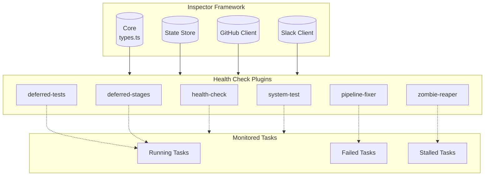
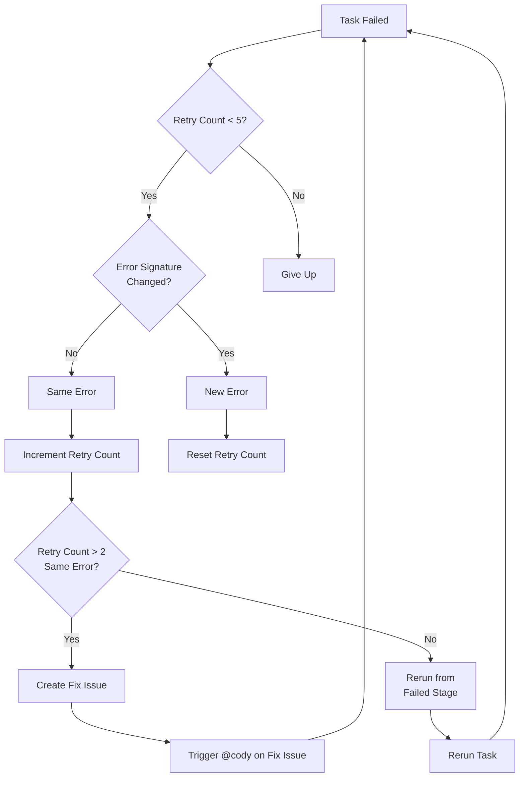
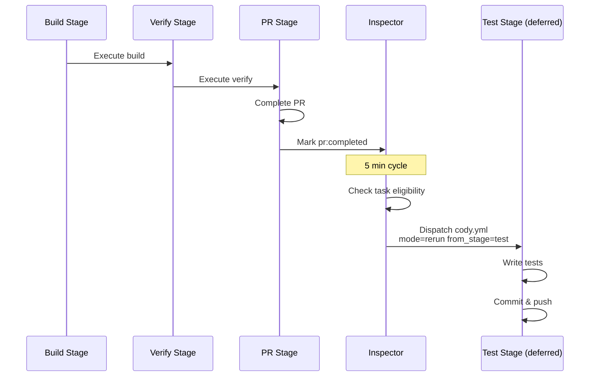
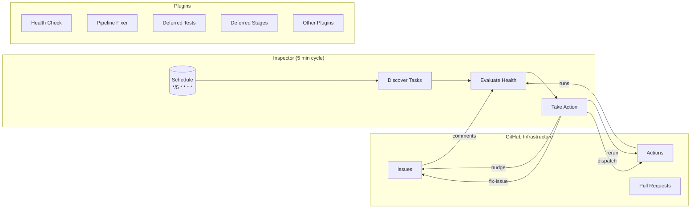

# Cody Pipeline Health Monitoring Architecture

This document describes the Inspector plugin framework and its role in monitoring and maintaining the Cody pipeline's health. The Inspector runs as a scheduled GitHub Actions workflow that periodically checks pipeline tasks and takes corrective actions when needed.

## Overview

The Inspector is an autonomous agent framework that runs every 5 minutes via a GitHub Actions workflow (`.github/workflows/inspector.yml`). It monitors Cody pipeline tasks, detects failures, and triggers corrective actions through a plugin-based architecture.

### Inspector Plugin Framework

The Inspector uses a plugin-based architecture that allows independent health monitoring and remediation strategies. Each plugin is responsible for a specific aspect of pipeline health.



### Core Components

The Inspector framework consists of several core components located in `scripts/inspector/core/`:

- **types.ts** (`scripts/inspector/core/types.ts`): Defines the core interfaces including `InspectorPlugin`, `ActionRequest`, `InspectorContext`, and `StateStore`. These types are domain-agnostic and can be reused for other inspector applications.

- **inspector.ts** (`scripts/inspector/core/inspector.ts`): The main runner that orchestrates plugin execution, state management, and action deduplication.

- **state.ts** (`scripts/inspector/core/state.ts`): Provides persistent state storage across inspector cycles using a JSON file at `.inspector/state.json`.

- **dedup.ts** (`scripts/inspector/core/dedup.ts`): Implements action deduplication to prevent duplicate actions within a configurable time window.

### Plugin Registry

All plugins are registered in `scripts/inspector/index.ts` using the `PluginRegistry` class from `scripts/inspector/plugins/registry.ts`. The registry ensures:
- No duplicate plugin names
- Plugins can be filtered by domain
- Plugin ordering is validated (health-check must run before pipeline-fixer and queue-manager)

## Health Check Plugins

The Inspector includes several health-check plugins that monitor different aspects of pipeline health.

### 1. Health Check Plugin (`cody-health-check`)

**Location**: `scripts/inspector/plugins/cody/health-check/index.ts`

The health-check plugin is the primary monitoring plugin that evaluates the health of each pipeline task by analyzing its `status.json` file.

#### What It Monitors

| Health Status | Description | Detection Method |
|--------------|-------------|------------------|
| `healthy` | Pipeline running normally | `status.state === 'running'` and updated within 20 minutes |
| `stalled` | No progress for >20 minutes | `status.state === 'running'` but `updatedAt` > 20 minutes ago |
| `orphaned` | Workflow crashed but status not updated | Workflow run terminated but `status.json` still says running |
| `gated` | Pipeline paused waiting for approval | `status.state === 'paused'` |
| `failed` | Pipeline failed or timed out | `status.state === 'failed'` or `status.state === 'timeout'` |
| `completed` | Pipeline completed successfully | `status.state === 'completed'` or `cody:done` label |
| `unknown` | No status information available | No status.json found |

#### Key Functions

- **`evaluateHealth()`**: Analyzes a task's status.json to determine its health state
- **`checkOrphanedWorkflow()`**: Detects workflows that crashed but didn't update status.json
- **`parseFailureFromComments()`**: Extracts failure details from GitHub issue comments (supports multiple comment formats)
- **`createNudgeAction()`**: Creates reminder actions for gated tasks waiting >30 minutes
- **`createDigestAction()`**: Generates periodic digest reports of all pipeline tasks

#### Staleness Detection

The health-check plugin uses a `STALENESS_THRESHOLD_MS` constant (20 minutes) to detect stalled pipelines. When a task hasn't been updated in over 20 minutes, it triggers either a `stalled` or `orphaned` health status.

### 2. Pipeline Fixer Plugin (`cody-pipeline-fixer`)

**Location**: `scripts/inspector/plugins/cody/pipeline-fixer/index.ts`

The pipeline-fixer implements an intelligent retry strategy that escalates persistent failures.

#### Retry Strategy



#### Retry Logic

1. **Retries 1-2**: Simple rerun from failed stage with error as feedback
2. **Retry 3 (same error)**: Creates a GitHub issue describing the failure and triggers `@cody` on it
3. **Retries 4-5**: Rerun original task (now with potentially fixed pipeline code)
4. **After 5 attempts**: Give up and mark as permanently failed

#### Configuration Constants

```typescript
const MAX_RETRIES = 5           // Maximum retry attempts
const FIX_ISSUE_THRESHOLD = 2   // Create fix issue after 2 retries with same error
const DEDUP_WINDOW_MINUTES = 15 // Prevent duplicate fix issues within 15 minutes
const FIX_ISSUE_LABEL = 'cody:pipeline-fix' // Label for fix issues
```

#### Non-Retryable Errors

Certain errors are not retried as they indicate infrastructure problems:
- API key errors
- Disk space errors (ENOSPC, "no space left", "disk full")

#### Cross-Task Deduplication

Before creating a fix issue, the plugin checks if an open fix issue already exists for the same stage failure. If so, it adds a comment instead of creating a duplicate issue.

### 3. Deferred Tests Plugin (`cody-deferred-tests`)

**Location**: `scripts/inspector/plugins/cody/deferred-tests/index.ts`

The deferred-tests plugin addresses the challenge of test coverage in the pipeline.

#### Why Tests Are Deferred

Test writing was removed from the live pipeline to eliminate the ~200 minute worst-case fix loops caused by test-impl mismatches (tests written against plan, not actual code).

#### How It Works

1. Monitors tasks that have completed the `pr` stage (pipeline finished)
2. Checks if the `test` stage was skipped or not completed
3. Verifies that `test.md` doesn't already exist
4. Triggers the test stage via `cody.yml` workflow dispatch with `mode=rerun from_stage=test`

#### Eligibility Criteria

A task is eligible for deferred tests if:
1. The `pr` stage is completed
2. The `test` stage is not completed
3. `test.md` output file does not exist
4. Task is not older than 7 days (staleness guard)

Unlike the deferred-stages plugin, there is no complexity threshold—every task gets tests.

### 4. Deferred Stages Plugin (`cody-deferred-stages`)

**Location**: `scripts/inspector/plugins/cody/deferred-stages/index.ts`

The deferred-stages plugin handles documentation generation for completed tasks.

#### Purpose

Documentation stages (docs) are expensive and not time-critical. This plugin defers docs generation to the inspector to reduce live pipeline time.

#### How It Works

1. Monitors tasks with `complexity >= 30` that completed without a docs stage
2. Ensures the feature branch still exists (not cleaned up)
3. Triggers the docs stage via `cody.yml` workflow dispatch

#### Complexity Threshold

Only tasks with complexity >= 30 are eligible for deferred docs, as defined in `scripts/cody/pipeline/definitions.ts`:

```typescript
// docs stage - deferred to nightly inspector (Knowledge Gardener plugin).
```

### 5. Zombie Reaper Plugin (`cody-zombie-reaper`)

**Location**: `scripts/inspector/plugins/cody/zombie-reaper/index.ts`

Detects and cleans up "zombie" workflow runs—runs that started but never completed or were cancelled without proper cleanup.

### 6. System Test Plugin (`cody-system-test`)

**Location**: `scripts/inspector/plugins/cody/system-test/index.ts`

Runs system tests against the pipeline to verify its health and functionality.

### 7. Queue Manager Plugin (`cody-queue-manager`)

**Location**: `scripts/inspector/plugins/cody/queue-manager/index.ts`

Manages the task queue and ensures proper ordering and resource allocation.

### 8. Success Tracker Plugin (`cody-success-tracker`)

**Location**: `scripts/inspector/plugins/cody/success-tracker/index.ts`

Tracks successful pipeline runs and collects metrics for analysis.

### 9. Failure Miner Plugin (`cody-failure-miner`)

**Location**: `scripts/inspector/plugins/cody/failure-miner/index.ts`

Analyzes pipeline failures to identify patterns and root causes.

### 10. Knowledge Gardener Plugin (`cody-knowledge-gardener`)

**Location**: `scripts/inspector/plugins/cody/knowledge-gardener/index.ts`

Manages documentation updates and knowledge base maintenance.

## Deferred Test and Docs Stages

The pipeline uses a deferred execution model for non-critical stages to improve throughput.

### Deferred Tests



The test stage is defined in `scripts/cody/pipeline/definitions.ts`:

```typescript
// test stage — TDD red phase: writes failing tests in parallel with build
stages.set('test', {
  name: 'test',
  type: 'agent',
  maxRetries: 1,
  preExecute: async (ctx) => {
    // Ensure feature branch for deferred test runs
    ensureFeatureBranch(ctx.taskId, td.task_type, undefined, ctx.taskDir)
  },
  postActions: [
    {
      type: 'commit-task-files',
      stagingStrategy: 'tracked+task',
      push: true,
      ensureBranch: true,
    },
  ],
})
```

### Deferred Docs

Similarly, the docs stage is skipped in the live pipeline and deferred to the inspector:

```typescript
// docs stage - deferred to nightly inspector
stages.set('docs', {
  name: 'docs',
  type: 'agent',
  // ... configuration
  shouldSkip: (ctx) => skipIfInputQuality(ctx, 'docs'),
})
```

## Troubleshooting Guide

### Common Failure Modes

#### 1. Stalled Pipeline

**Symptom**: Task shows `health: stalled` with "No progress for X minutes"

**Diagnosis**:
```bash
# Check the workflow run status
gh run list --workflow=cody.yml --branch=feat/TASK_ID
```

**Resolution**:
- Check if the GitHub Actions runner is experiencing issues
- Manually trigger a rerun: `gh workflow run cody.yml -f task_id=TASK_ID --repo owner/repo`

#### 2. Orphaned Workflow

**Symptom**: Task shows `health: orphaned` - "Workflow run terminated but status.json still says running"

**Diagnosis**:
```bash
# Check workflow run conclusion
gh run list --workflow=cody.yml --branch=feat/TASK_ID --json status,conclusion
```

**Resolution**: The pipeline-fixer plugin will automatically retry this task on the next cycle.

#### 3. Gated Task Not Progressing

**Symptom**: Task shows `health: gated` with "Pipeline paused for X minutes"

**Resolution**:
- Run `/cody approve` on the issue to continue
- Run `/cody reject` to cancel the task

#### 4. Persistent Failure

**Symptom**: Task has failed multiple times with the same error

**Diagnosis**:
```bash
# Check fixer state
cat .inspector/state.json | grep "cody:fixerState"
```

**Resolution**:
- The pipeline-fixer will create a fix issue after 2 retries with the same error
- Review the fix issue for details on the underlying problem

#### 5. Test Stage Missing

**Symptom**: Task completed PR but has no test coverage

**Diagnosis**:
```bash
# Check if test.md exists
ls -la .tasks/TASK_ID/test.md
```

**Resolution**: The deferred-tests plugin will automatically trigger test generation within 7 days of task completion.

### Debugging Inspector Issues

#### Check Inspector State

```bash
# View inspector state
cat .inspector/state.json | jq .
```

#### Run Inspector Manually

```bash
# Dry run (no actions)
DRY_RUN=true pnpm tsx scripts/inspector/index.ts

# Full run
pnpm tsx scripts/inspector/index.ts
```

#### Check Inspector Logs

Inspector logs are available in the GitHub Actions run for the inspector workflow.

### Recovery Procedures

#### Reset a Stuck Task

1. Update `status.json` to mark the task as failed:
```json
{
  "state": "failed",
  "stages": {
    "build": { "state": "failed", "error": "Manual reset" }
  }
}
```

2. The pipeline-fixer will pick it up on the next cycle

#### Force Retry a Task

1. Add label `cody:rerun` to the issue
2. The inspector will trigger a fresh pipeline run

## Architecture Summary



## File Reference

| File | Purpose |
|------|---------|
| `.github/workflows/inspector.yml` | Inspector workflow definition |
| `scripts/inspector/index.ts` | Inspector entry point and plugin registration |
| `scripts/inspector/core/types.ts` | Core type definitions |
| `scripts/inspector/core/inspector.ts` | Main inspector runner |
| `scripts/inspector/core/state.ts` | State persistence |
| `scripts/inspector/plugins/registry.ts` | Plugin registry |
| `scripts/inspector/plugins/cody/health-check/index.ts` | Health monitoring |
| `scripts/inspector/plugins/cody/pipeline-fixer/index.ts` | Retry logic |
| `scripts/inspector/plugins/cody/deferred-tests/index.ts` | Deferred test execution |
| `scripts/inspector/plugins/cody/deferred-stages/index.ts` | Deferred docs execution |
| `scripts/cody/pipeline/definitions.ts` | Pipeline stage definitions |

## Related Documentation

- [Pipeline Orchestrated Plan](./pipeline-orchestrated-plan.md)
- [Self-Growing Pipeline](./self-growing-pipeline/README.md)
- [Cody Pipeline Overview](../cody/README.md)
