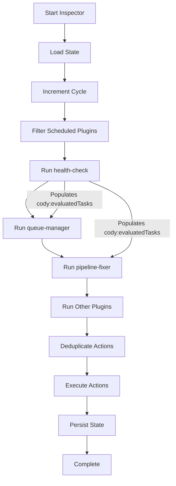
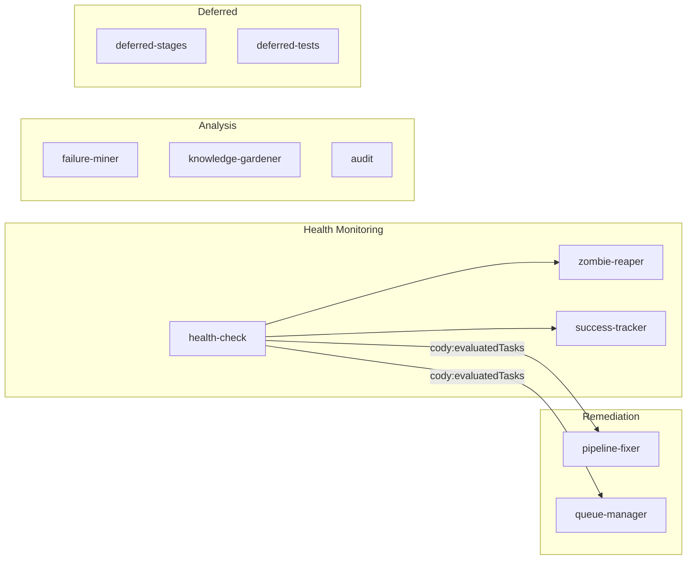
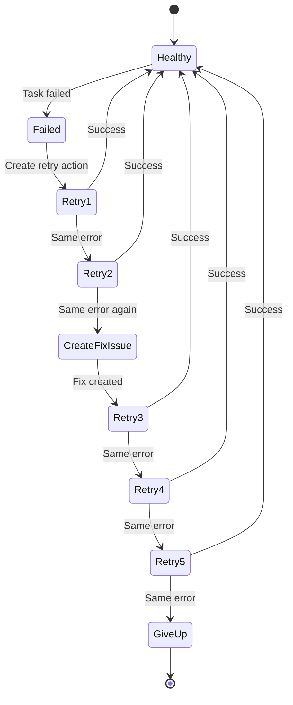
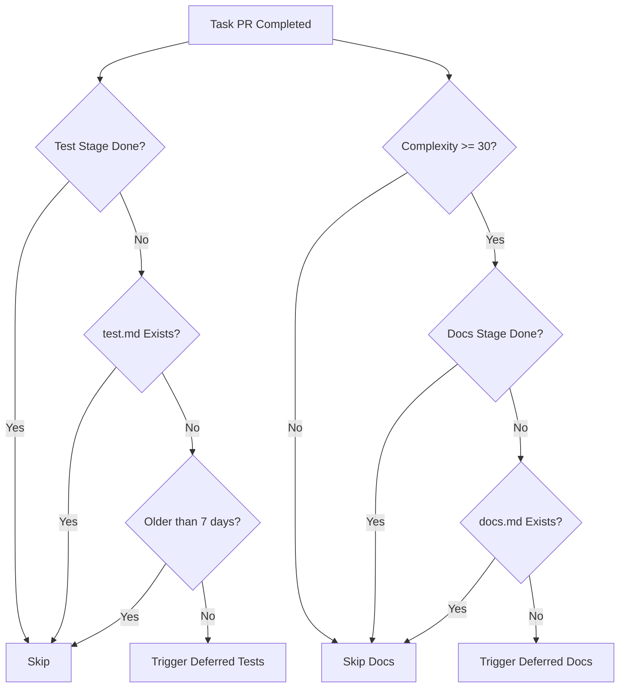
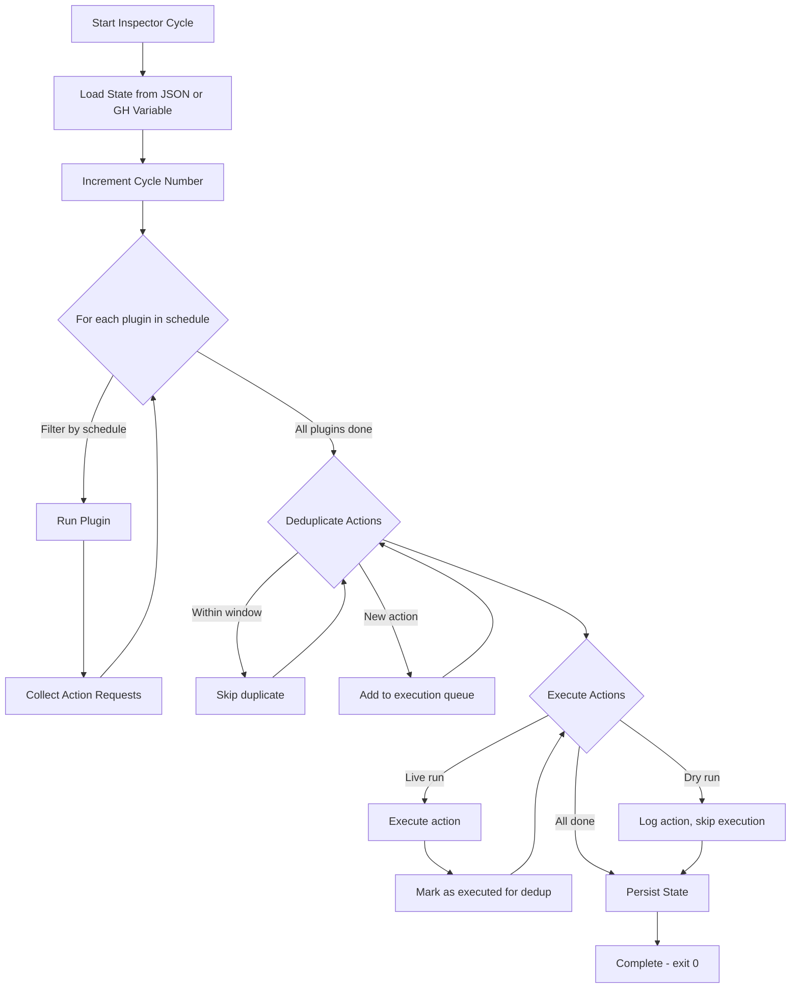
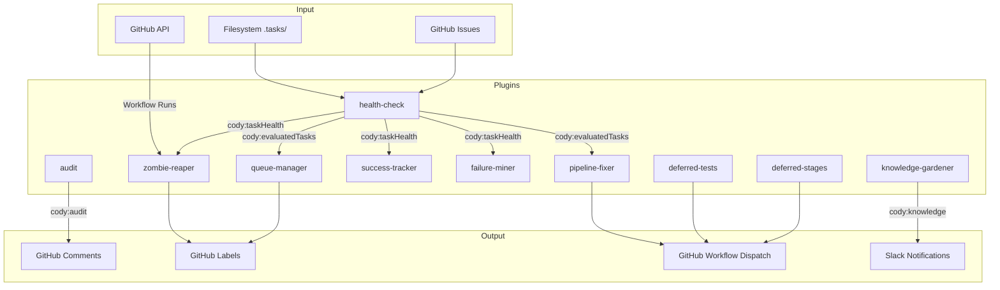
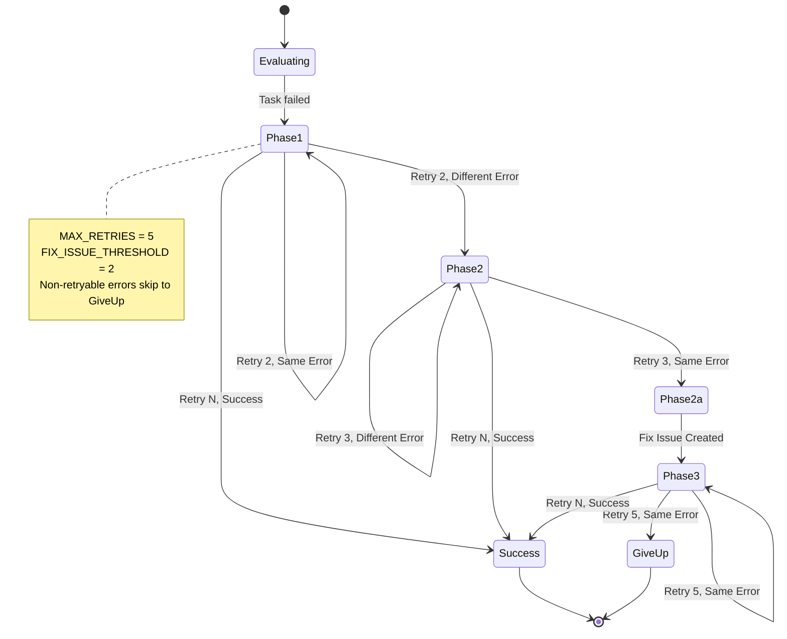

# Cody Pipeline Health Monitoring Architecture

This document describes the Inspector plugin framework that monitors and maintains the health of the Cody pipeline. The Inspector runs as a scheduled GitHub Actions workflow that executes plugins to detect issues, retry failed tasks, clean up stuck processes, and generate health reports.

## Overview: Inspector Plugin Framework

The Inspector is a plugin-based orchestration system defined in `scripts/inspector/index.ts`. It provides a flexible architecture where plugins can be registered, scheduled, and executed in a predictable order with built-in state persistence, action deduplication, and error isolation.

### Core Components

The framework consists of several core modules located in `scripts/inspector/core/`:

- **`scripts/inspector/index.ts`** — CLI entry point that validates environment variables, creates the plugin registry, and orchestrates the Inspector run
- **`scripts/inspector/core/inspector.ts`** — Main Inspector loop that runs plugins, deduplicates actions, executes actions, and persists state
- **`scripts/inspector/core/types.ts`** — TypeScript interfaces for `InspectorPlugin`, `ActionRequest`, `InspectorContext`, `StateStore`, and Cody-specific types like `TaskHealth`, `EvaluatedTask`, and `TaskSnapshot`
- **`scripts/inspector/plugins/registry.ts`** — `PluginRegistry` class that manages plugin registration, retrieval by domain, and duplicate detection

### State Persistence

The Inspector maintains state across cycles using two backends defined in `scripts/inspector/core/state.ts`:

- **`JsonStateStore`** — JSON file-based storage for local development and testing. Uses atomic writes (write to temp file, then rename) for safety. Stored at `.inspector/state.json` by default.
- **`GhVariableStateStore`** — GitHub Actions repository variable storage for CI persistence. Reads and writes the `INSPECTOR_STATE` variable, which survives across ephemeral CI runners.

The factory function `createStateStore(repo, localFilePath)` automatically selects the appropriate backend based on the `GITHUB_ACTIONS` environment variable.

### Deduplication Engine

Actions can be deduplicated to prevent repeated execution within a time window. The deduplication logic in `scripts/inspector/core/dedup.ts` provides:

- **`shouldDedup(action, ctx)`** — Checks if an action with the same `dedupKey` was executed within the `dedupWindowMinutes` period
- **`markExecuted(action, ctx)`** — Records successful action execution with a timestamp
- **`cleanupExpiredDedup(ctx)`** — Removes dedup entries older than 24 hours to prevent unbounded state growth

Each action can specify its own `dedupKey` and `dedupWindowMinutes` (default: 60 minutes). This prevents the Inspector from spamming issues with repeated nudge messages or retry triggers.

### Plugin Lifecycle

Plugins implement the `InspectorPlugin` interface from `scripts/inspector/core/types.ts`:

```typescript
interface InspectorPlugin {
  name: string
  description: string
  domain: string
  schedule?: PluginSchedule
  run(ctx: InspectorContext): Promise<ActionRequest[]>
}
```

The Inspector runs in cycles. On each cycle:

1. **Load state** from the persistent store (JSON file or GH variable)
2. **Increment cycle number** for tracking
3. **Filter plugins** by their schedule (e.g., `every: 6` runs every 6th cycle)
4. **Execute each plugin** in registration order, collecting action requests
5. **Deduplicate actions** based on dedup keys and time windows
6. **Execute actions** (unless dry-run mode is enabled)
7. **Persist state** back to the store

Error isolation ensures that if one plugin fails, the others continue executing. Plugin errors are logged but don't crash the entire Inspector run.

### GitHub and Slack Clients

Plugins interact with external services through clients in `scripts/inspector/clients/`:

- **`scripts/inspector/clients/github.ts`** — GitHub API client for reading issues, posting comments, managing labels, triggering workflows, and searching issues
- **`scripts/inspector/clients/slack.ts`** — Slack webhook client for sending notifications

### Plugin Registration and Ordering

The Inspector validates critical plugin ordering at startup. Specifically, `health-check` must be registered before `pipeline-fixer` and `queue-manager` because those plugins consume the `cody:evaluatedTasks` state that health-check produces. This validation happens in `scripts/inspector/index.ts` lines 89-105 and will exit with an error if the order is violated.



## Health-Check Plugins

The Inspector includes 15+ plugins that monitor different aspects of pipeline health. Each plugin is registered in `scripts/inspector/index.ts` and executes during the Inspector cycle.

### Core Health Monitoring Plugins

#### Health Check (`cody-health-check`)

**File:** `scripts/inspector/plugins/cody/health-check/index.ts`

This is the primary health monitoring plugin. It discovers all active Cody tasks from GitHub issues, evaluates their health status, and creates appropriate actions.

**Task Discovery:** The plugin uses `scripts/inspector/plugins/cody/health-check/discovery.ts` to find tasks by querying GitHub issues with Cody lifecycle labels (`cody:planning`, `cody:building`, `cody:review`, `cody:done`, `cody:failed`, `cody:queued`, `cody:queue-active`).

**Health States:** The plugin evaluates each task into one of seven health states:

- **`healthy`** — Pipeline running normally, updated within last 20 minutes
- **`completed`** — Pipeline finished successfully (state = 'completed' or has `cody:done` label)
- **`stalled`** — No progress for more than 20 minutes
- **`orphaned`** — Workflow terminated but status.json still says running
- **`failed`** — Pipeline failed or timed out at a specific stage
- **`gated`** — Pipeline paused waiting for approval
- **`unknown`** — No status.json found or unrecognized state

**Actions Produced:**
- **Nudge actions** — Posted to issues with gated tasks that have been waiting more than 30 minutes. Urgency escalates from `warning` (30-120 min) to `critical` (120+ min).
- **Digest action** — Weekly summary posted to a configured digest issue (via `INSPECTOR_DIGEST_ISSUE` env var) showing all actionable tasks with their health status and fixer state.

**State Sharing:** The plugin shares evaluated tasks with other plugins via the `cody:evaluatedTasks` state key, which `pipeline-fixer` and `queue-manager` consume.

#### Pipeline Fixer (`cody-pipeline-fixer`)

**File:** `scripts/inspector/plugins/cody/pipeline-fixer/index.ts`

This plugin handles retry logic for failed tasks. It reads evaluated tasks from the `cody:evaluatedTasks` state (populated by health-check) and determines what action to take.

See the dedicated section below for detailed retry strategy documentation.

#### Queue Manager (`cody-queue-manager`)

**File:** `scripts/inspector/plugins/cody/queue-manager/index.ts`

Manages the Cody pipeline queue by tracking active tasks and preventing concurrent execution. Uses queue state stored in `cody:queueState` to coordinate task scheduling.

#### Zombie Reaper (`cody-zombie-reaper`)

**File:** `scripts/inspector/plugins/cody/zombie-reaper/index.ts`

Cleans up tasks that appear stuck in "running" state but have no active CI workflow. This happens when CI crashes or times out but status.json is never updated. The plugin scans `.tasks/` directories for tasks stale >2 hours, cross-references active GitHub workflow runs, and marks confirmed zombies as failed by adding the `cody:failed` label.

Uses the `cody:reapedTasks` state key to track reaped tasks across cycles, with a 7-day TTL to eventually allow reprocessing.

### Supporting Health Plugins

#### Success Tracker (`cody-success-tracker`)

**File:** `scripts/inspector/plugins/cody/success-tracker/index.ts`

Tracks pipeline success metrics across cycles, computing statistics on task completion rates, stage failure rates, and retry effectiveness. Posts periodic summaries to track pipeline reliability trends.

#### Failure Miner (`cody-failure-miner`)

**File:** `scripts/inspector/plugins/cody/failure-miner/index.ts`

Analyzes failure patterns across multiple tasks to identify recurring issues. Collects failure data, analyzes stage-level errors, and reports systemic problems that may indicate pipeline-wide issues.

#### Knowledge Gardener (`cody-knowledge-gardener`)

**File:** `scripts/inspector/plugins/cody/knowledge-gardener/index.ts`

Extracts and maintains knowledge from completed tasks, pruning stale entries and cataloging successful patterns. This nightly-run plugin subsumes the removed "reflect" stage functionality.

#### Audit (`cody-audit`)

**File:** `scripts/inspector/plugins/cody/audit/index.ts`

Provides audit capabilities using AI (requires `MINIMAX_API_KEY`) to analyze task outcomes and generate detailed reports. Falls back to rule-based analysis when the API key is unavailable.

### Deferred Stage Plugins

These plugins handle stages that were removed from the live pipeline to improve execution time but are still valuable to run when resources permit.

#### Deferred Stages (`cody-deferred-stages`)

**File:** `scripts/inspector/plugins/cody/deferred-stages/index.ts`

Triggers the `docs` stage for tasks (complexity ≥30) that completed the PR but missed docs generation. Runs every 6th cycle (~30 minutes) to batch up multiple completed tasks.

#### Deferred Tests (`cody-deferred-tests`)

**File:** `scripts/inspector/plugins/cody/deferred-tests/index.ts`

Triggers test writing for tasks that completed PR but have no test coverage. Unlike the deferred-stages plugin, this has no complexity threshold but includes a 7-day staleness guard to skip old tasks. Runs every 6th cycle.

### Test Coordination Plugins

#### System Test (`cody-system-test`)

**File:** `scripts/inspector/plugins/cody/system-test/index.ts`

Coordinates system test execution for qualified tasks.

#### CLI Test (`cody-cli-test`)

**File:** `scripts/inspector/plugins/cody/cli-test/index.ts`

Coordinates CLI test execution for qualified tasks.

### Project-Level Plugins

These plugins run against the entire repository rather than individual tasks.

#### Security Scanner (`project-security-scanner`)

**File:** `scripts/inspector/plugins/project/security-scanner/index.ts`

Scans the codebase for security vulnerabilities using rule-based detection. Helps maintain security posture by identifying issues before they become problems.

#### API Surface Auditor (`project-api-surface`)

**File:** `scripts/inspector/plugins/project/api-surface/index.ts`

Catalogs and monitors the project's API surface, tracking changes to public interfaces and alerting on potential breaking changes.

#### Docs Sync (`docs-sync`)

**File:** `scripts/inspector/plugins/docs-sync/index.ts`

Synchronizes documentation changes, ensuring docs stay current with code changes.



## Pipeline Fixer Retry Strategy

The pipeline-fixer plugin (`scripts/inspector/plugins/cody/pipeline-fixer/index.ts`) implements an intelligent retry strategy that balances persistence with efficiency. It distinguishes between transient failures (which can be retried) and persistent failures (which require pipeline code fixes).

### Retry Constants

The plugin uses these constants (defined at the top of the file):

- **`MAX_RETRIES = 5`** — Maximum retry attempts before giving up
- **`FIX_ISSUE_THRESHOLD = 2`** — Create a fix issue after this many retries with the same error
- **`DEDUP_WINDOW_MINUTES = 15`** — Prevent duplicate retry actions within 15 minutes
- **`FIX_ISSUE_LABEL = 'cody:pipeline-fix'`** — Label applied to created fix issues

### Retry Flow

The plugin implements a three-phase retry strategy:

**Phase 1: Simple Retries (Retries 1-2)**
For the first two attempts, the plugin triggers a simple rerun from the failed stage. The stage is resolved using the `resolveFromStage()` helper which maps stage names to their corresponding workflow dispatch values:
- `commit` → `commit`
- `pr` → `pr`
- `verify` or `autofix` → `build`
- `unknown` → empty string (let pipeline decide)
- Other stages → pass through as-is

The retry includes feedback from the failed stage's output (up to 2000 characters) to help the next attempt.

**Phase 2: Fix Issue Escalation (Retry 3)**
If the same error persists after two retries (determined by comparing error signatures), the plugin creates a GitHub issue tagged `cody:pipeline-fix` describing the failure. The issue includes:
- Task ID and issue reference
- Full error message
- Stage output from the failed stage
- Verify output for context
- History of what was tried
- Original task issue body

The plugin then triggers `@cody` on this new issue to have Cody analyze and fix the pipeline code itself.

**Phase 3: Post-Fix Retries (Retries 4-5)**
After the fix issue is created and potentially resolved, the plugin retries the original task. These retries run with the potentially fixed pipeline code, giving the fix a chance to work.

**Give Up**
After 5 total retries, the plugin gives up and posts a message to the original issue indicating manual intervention is required.

### Error Signature and Deduplication

The plugin computes an error signature using the `errorSignature()` helper:

```typescript
function errorSignature(stage: string, error: string): string {
  return `${stage}:${error.slice(0, 200).trim()}`
}
```

This signature is used to detect when the same failure keeps happening across retries, triggering the fix issue escalation.

### Cross-Task Deduplication

To prevent flooding the repository with duplicate fix issues, the plugin implements cross-task deduplication via `findExistingFixIssue()`:

1. **State-based check** — Scans fixer state for other tasks that already created fix issues for the same stage failure
2. **GitHub search** — Searches for open issues with the `cody:pipeline-fix` label and similar titles

If an existing fix issue is found, the plugin posts a comment linking the current task to that issue instead of creating a duplicate. This ensures that if multiple tasks fail at the same stage with the same error, they're consolidated into a single fix effort.

### Non-Retryable Errors

Certain errors are marked as non-retryable because retrying won't help:

- API key errors (`api key`, `_api_key`)
- Disk full errors (`enospc`, `no space left on device`, `disk full`)

For these, the plugin posts a message indicating the infrastructure problem that needs to be resolved before retrying.

### State Pruning

The fixer state can grow unbounded, so `pruneFixerState()` keeps it manageable:

- **`MAX_ENTRIES = 100`** — Keep only the 100 most recent entries
- Entries are sorted by retry count (highest first) before pruning

This ensures the state file doesn't grow indefinitely while keeping the most relevant retry history.



## Deferred Test and Docs Stages

Two stages were removed from the live pipeline to improve execution time: `docs` and `test`. The Inspector runs these stages asynchronously for eligible tasks.

### Deferred Docs Stage

**File:** `scripts/inspector/plugins/cody/deferred-stages/index.ts`

The docs stage was removed because it adds 2-5 minutes and 1 LLM call per pipeline run. The deferred-stages plugin picks up the slack by running docs for high-value tasks.

**Eligibility Criteria:**
1. Task complexity ≥ 30 (matching the review threshold in the pipeline)
2. PR stage completed (`stages.pr.state === 'completed'`)
3. Docs stage NOT completed
4. `docs.md` output file does NOT exist

**Execution:**
- Runs every 6th cycle (~30 minutes) to batch multiple completed tasks
- Triggers `cody.yml` workflow dispatch with:
  - `mode: 'rerun'`
  - `from_stage: 'docs'`
- Uses 6-hour dedup window to prevent retriggering the same task

**Complexity Threshold:** The threshold of 30 matches the pipeline's review complexity threshold. Low-complexity tasks skip docs entirely because the documentation overhead isn't justified for simple changes.

### Deferred Tests Stage

**File:** `scripts/inspector/plugins/cody/deferred-tests/index.ts`

The test stage was removed from the live pipeline because test-impl mismatches (tests written against the plan, not the actual code) caused ~200 minute worst-case fix loops in some cases.

**Eligibility Criteria:**
1. PR stage completed
2. Test stage NOT completed
3. `test.md` output file does NOT exist
4. Task is NOT older than 7 days (staleness guard)

**Differences from Deferred Docs:**
- **No complexity threshold** — Every task gets tests regardless of complexity
- **7-day staleness guard** — Tasks older than 7 days are skipped to prevent infinite retry loops on abandoned tasks
- **Different feedback** — Passes feedback indicating this is a "deferred test run" to encourage fresh test generation on the actual implemented code

**Execution:**
- Runs every 6th cycle (~30 minutes)
- Triggers `cody.yml` workflow dispatch with:
  - `mode: 'rerun'`
  - `from_stage: 'test'`
  - `feedback: 'Deferred test run: write tests for the implemented code on dev. Create a new test branch.'`



## Troubleshooting Guide

This section covers common failure modes encountered when running the Inspector and how to diagnose and resolve them.

### Orphaned Workflows

**Symptom:** A task shows as "running" in status.json but the GitHub workflow has terminated (completed or cancelled) without success.

**Root Cause:** The CI workflow crashed or was cancelled, but the status.json update never happened because the process died.

**Detection:** The health-check plugin in `scripts/inspector/plugins/cody/health-check/index.ts` uses `checkOrphanedWorkflow()` to query GitHub's run list. If the workflow status is "completed" or "cancelled" with a non-success conclusion while status.json says "running", it's marked as orphaned.

**Resolution:** The health-check plugin marks the task as "orphaned" health. The pipeline-fixer will then retry the task from the appropriate stage to complete the work.

### Zombie Tasks

**Symptom:** A task appears stuck in "running" state with no recent updates and no active GitHub workflow.

**Root Cause:** Similar to orphaned workflows, but the workflow has already fully terminated and been cleaned up by GitHub. The status.json wasn't updated because the process died.

**Detection:** The zombie-reaper plugin (`scripts/inspector/plugins/cody/zombie-reaper/index.ts`) scans for tasks stale >2 hours (`STALE_THRESHOLD_MS = 2 * 60 * 60 * 1000`), cross-references against active GitHub workflow runs, and confirms zombies by the absence of any running workflow for the task's branch.

**Resolution:** The zombie-reaper adds the `cody:failed` label and updates status.json to mark the task as failed, allowing the pipeline-fixer to retry or give up appropriately.

### Stalled Tasks

**Symptom:** A task shows as "running" but hasn't made progress in over 20 minutes.

**Root Cause:** The pipeline may be stuck in a long operation, waiting on external resources, or experiencing severe performance issues.

**Detection:** The health-check plugin uses `STALENESS_THRESHOLD_MS = 20 * 60 * 1000` (20 minutes). If the `updatedAt` timestamp in status.json is older than this threshold, the task is marked as "stalled".

**Resolution:** Currently, stalled tasks just show in the health digest. Future versions may add automatic intervention. For now, manual investigation is required.

### Non-Retryable Infrastructure Failures

**Symptom:** A task fails with an API key error or disk full error, and retries don't help.

**Root Cause:** These are infrastructure problems that retrying won't solve — the API key needs to be fixed, or disk space needs to be freed.

**Detection:** The pipeline-fixer checks the error message against known non-retryable patterns in `isNonRetryable()`:

```typescript
function isNonRetryable(error: string): boolean {
  const lower = error.toLowerCase()
  return (
    lower.includes('api key') ||
    lower.includes('_api_key') ||
    lower.includes('enospc') ||
    lower.includes('no space left') ||
    lower.includes('disk full')
  )
}
```

**Resolution:** The plugin posts a message indicating manual intervention is required. Fix the infrastructure issue, then manually rerun the task.

### Plugin Ordering Violations

**Symptom:** Inspector exits with error: "Plugin order violation: health-check must be registered before pipeline-fixer and queue-manager"

**Root Cause:** Someone modified `scripts/inspector/index.ts` and changed the plugin registration order incorrectly.

**Detection:** The validation in `scripts/inspector/index.ts` lines 89-105 checks plugin indices at startup and exits with an error if order is wrong.

**Resolution:** Reorder the `registry.register()` calls so health-check comes before pipeline-fixer and queue-manager. The health-check plugin must populate `cody:evaluatedTasks` before those plugins try to read it.

### State Persistence Failures

**Symptom:** Inspector logs show "[GhVariableStateStore] Failed to save state" but the Inspector continues running.

**Root Cause:** The GH PAT doesn't have sufficient permissions (`actions:write` + `variables:write`), or the `gh` CLI isn't available.

**Detection:** Check Inspector logs for the error message from `scripts/inspector/core/state.ts`.

**Resolution:** 
- Ensure `GH_PAT` environment variable is set with a token that has `actions:write` and `variables:write` permissions
- Verify the `gh` CLI is available in the CI environment
- Note: The Inspector continues running even if state persistence fails — actions still execute, but cycle counting and dedup may not persist correctly across runs

### Dedup Preventing Expected Actions

**Symptom:** You expect an action (like a nudge or retry) but it's not being executed.

**Root Cause:** The action was already executed within its dedup window, and the system is preventing duplicate actions.

**Detection:** Check Inspector logs for "Action deduplicated" entries showing the dedup key.

**Resolution:**
- Wait for the dedup window to expire (default 60 minutes, can be shorter for retries)
- For testing, set `DRY_RUN=true` to see all actions without executing them
- Check the `.inspector/state.json` file for dedup entries if running locally

### Missing INSPECTOR_DIGEST_ISSUE

**Symptom:** Inspector logs show "INSPECTOR_DIGEST_ISSUE not set — digest reports will be skipped"

**Root Cause:** The `INSPECTOR_DIGEST_ISSUE` environment variable isn't configured.

**Resolution:** Set `INSPECTOR_DIGEST_ISSUE` to the issue number where you want weekly digest reports posted. The health-check plugin will post a table of all actionable tasks with their health status and fixer state.

## Architecture Diagrams

### Inspector Loop Flow



### Plugin Dependency Graph



### Pipeline Fixer State Machine



## Appendix: Environment Variables

The Inspector uses these environment variables:

| Variable | Required | Description |
|----------|----------|-------------|
| `REPO` | Yes | GitHub repository in `owner/repo` format |
| `GH_TOKEN` | Yes | GitHub token with issues, labels, and workflow permissions |
| `GH_PAT` | No | Personal access token with `actions:write` and `variables:write` for retries and state persistence |
| `DRY_RUN` | No | Set to `true` to run without executing actions |
| `INSPECTOR_DIGEST_ISSUE` | No | Issue number for weekly health digest reports |
| `MINIMAX_API_KEY` | No | API key for AI-powered audit analysis |
| `SLACK_WEBHOOK_URL` | No | Webhook URL for Slack notifications |
| `LOG_LEVEL` | No | Pino log level (default: `info`) |

## Appendix: File Reference

Key files in the Inspector codebase:

- `scripts/inspector/index.ts` — CLI entry point
- `scripts/inspector/core/inspector.ts` — Main Inspector loop
- `scripts/inspector/core/types.ts` — TypeScript interfaces
- `scripts/inspector/core/state.ts` — State persistence (JsonStateStore, GhVariableStateStore)
- `scripts/inspector/core/dedup.ts` — Action deduplication
- `scripts/inspector/plugins/registry.ts` — Plugin registry
- `scripts/inspector/plugins/cody/health-check/index.ts` — Health evaluation
- `scripts/inspector/plugins/cody/health-check/discovery.ts` — Task discovery
- `scripts/inspector/plugins/cody/pipeline-fixer/index.ts` — Retry logic
- `scripts/inspector/plugins/cody/zombie-reaper/index.ts` — Zombie cleanup
- `scripts/inspector/plugins/cody/queue-manager/index.ts` — Queue management
- `scripts/inspector/plugins/cody/deferred-stages/index.ts` — Deferred docs
- `scripts/inspector/plugins/cody/deferred-tests/index.ts` — Deferred tests
- `scripts/inspector/clients/github.ts` — GitHub API client
- `scripts/inspector/clients/slack.ts` — Slack client
