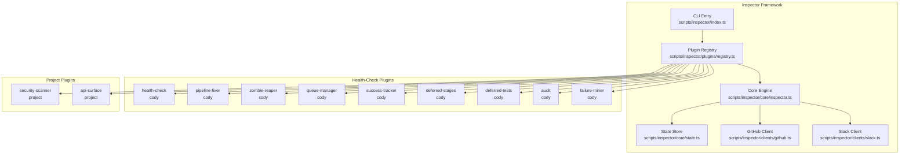
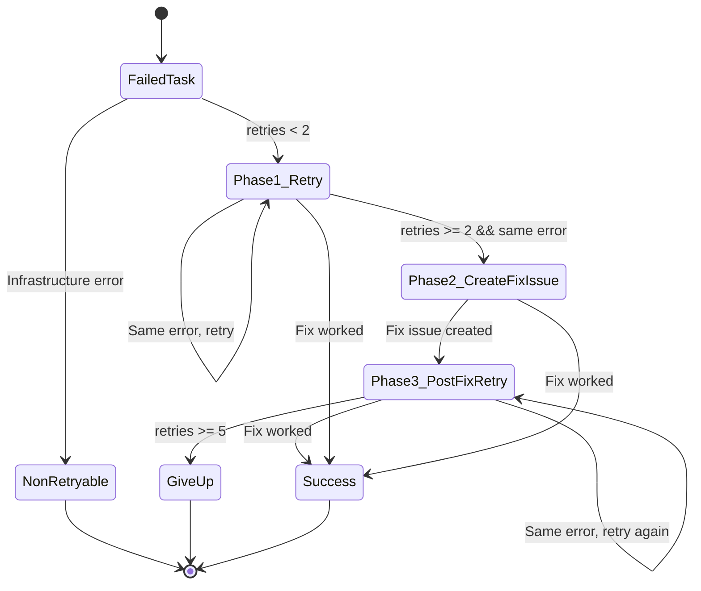

# Pipeline Health Monitoring Architecture

This document describes the Cody pipeline health monitoring architecture implemented via the Inspector framework. Inspector is a plugin-based system that continuously monitors pipeline health, detects failures, and takes corrective actions.

## Overview

The Inspector framework is a standalone CLI tool located in `scripts/inspector/` that runs as a scheduled GitHub Action (defined in `.github/workflows/inspector.yml`). It uses a plugin architecture to perform health checks, retries, and maintenance tasks for the Cody pipeline.

### Architecture Components



### Plugin Registration

Plugins are registered in `scripts/inspector/index.ts` which serves as the CLI entry point. The registration order is critical—some plugins depend on state populated by earlier plugins:

```typescript
// From scripts/inspector/index.ts (lines 69-85)
registry.register(healthCheckPlugin)       // MUST run first
registry.register(queueManagerPlugin)       // Depends on health-check
registry.register(pipelineFixerPlugin)      // Depends on health-check
registry.register(auditPlugin)
registry.register(deferredStagesPlugin)
registry.register(deferredTestsPlugin)
registry.register(docsSyncPlugin)
registry.register(zombieReaperPlugin)
registry.register(successTrackerPlugin)
registry.register(failureMinerPlugin)
registry.register(knowledgeGardenerPlugin)
registry.register(securityScannerPlugin)
registry.register(apiSurfaceAuditorPlugin)
registry.register(systemTestPlugin)
```

### Core Types

The Inspector framework defines core types in `scripts/inspector/core/types.ts`:

```typescript
export interface InspectorPlugin {
  name: string
  description: string
  domain: string
  schedule?: PluginSchedule
  run(ctx: InspectorContext): Promise<ActionRequest[]>
}

export interface ActionRequest {
  plugin: string
  type: string
  target?: string
  urgency: Urgency
  title: string
  detail: string
  dedupKey?: string
  dedupWindowMinutes?: number
  execute: (ctx: InspectorContext) => Promise<ActionResult>
}

export type TaskHealth = 
  | 'healthy' 
  | 'completed' 
  | 'stalled' 
  | 'failed' 
  | 'gated' 
  | 'orphaned' 
  | 'unknown'
```

---

## Health-Check Plugins

This section documents each health-check plugin and what it monitors.

### 1. Health Check Plugin (`cody-health-check`)

**Location**: `scripts/inspector/plugins/cody/health-check/index.ts`

**Purpose**: Monitor Cody pipeline health and take corrective action

**Responsibilities**:
- Discover active Cody tasks from `.tasks/` directory
- Evaluate health status for each task
- Create nudge actions for gated tasks
- Create digest reports for visibility
- Share evaluated tasks via state for other plugins

**Health States Evaluated**:
| State | Description |
|-------|-------------|
| `healthy` | Pipeline running normally |
| `completed` | Pipeline finished successfully |
| `stalled` | No progress for 20+ minutes |
| `failed` | Pipeline failed or timed out |
| `gated` | Pipeline paused waiting for approval |
| `orphaned` | Workflow ended but status.json still says running |
| `unknown` | No status.json found |

**Key Constants**:
```typescript
const STALENESS_THRESHOLD_MS = 20 * 60 * 1000 // 20 minutes
```

**Actions Produced**:
- `nudge`: Posts comment to gated tasks after 30 minutes
- `digest`: Posts health summary to digest issue (configured via `INSPECTOR_DIGEST_ISSUE`)

### 2. Pipeline Fixer Plugin (`cody-pipeline-fixer`)

**Location**: `scripts/inspector/plugins/cody/pipeline-fixer/index.ts`

**Purpose**: Retry failed tasks and escalate persistent failures

**See dedicated section below for details.**

### 3. Zombie Reaper Plugin (`zombie-reaper`)

**Location**: `scripts/inspector/plugins/cody/zombie-reaper/index.ts`

**Purpose**: Clean up tasks stuck in 'running' state with no active CI workflow

**Triggers When**:
- Task has `state=running` in status.json
- No active GitHub workflow run exists for `feat/{taskId}` branch
- Task is stale for more than 2 hours

**Actions Produced**:
- `reap-zombies`: Marks confirmed zombies as failed and posts notification

**State Management**:
- Tracks reaped task IDs in state store (survives ephemeral CI runners)
- 7-day TTL for reaped task entries

### 4. Queue Manager Plugin (`cody-queue-manager`)

**Location**: `scripts/inspector/plugins/cody/queue-manager/index.ts`

**Purpose**: Manages the Cody task queue and ensures only one task runs at a time

**Key Features**:
- Tracks active task via `queueState.activeTaskId`
- Prevents pipeline-fixer from retrying active queue-managed tasks
- Stores queue state in `scripts/inspector/plugins/cody/queue-manager/queue-state.ts`

### 5. Success Tracker Plugin (`success-tracker`)

**Location**: `scripts/inspector/plugins/cody/success-tracker/index.ts`

**Purpose**: Track pipeline success rates and generate metrics

**Key Files**:
- Metrics: `scripts/inspector/plugins/cody/success-tracker/metrics.ts`
- Formatter: `scripts/inspector/plugins/cody/success-tracker/formatter.ts`

### 6. Failure Miner Plugin (`failure-miner`)

**Location**: `scripts/inspector/plugins/cody/failure-miner/index.ts`

**Purpose**: Analyze failure patterns and report recurring issues

**Key Files**:
- Collector: `scripts/inspector/plugins/cody/failure-miner/collector.ts`
- Analyzer: `scripts/inspector/plugins/cody/failure-miner/analyzer.ts`
- Reporter: `scripts/inspector/plugins/cody/failure-miner/reporter.ts`

### 7. Audit Plugin (`cody-audit`)

**Location**: `scripts/inspector/plugins/cody/audit/index.ts`

**Purpose**: Audit pipeline runs and log for compliance

**Key Files**:
- Types: `scripts/inspector/plugins/cody/audit/types.ts`
- Analyzer: `scripts/inspector/plugins/cody/audit/analyzer.ts`
- Actions: `scripts/inspector/plugins/cody/audit/actions/create-issue.ts`

---

## Pipeline Fixer Retry Strategy

The pipeline-fixer implements a sophisticated retry strategy with multiple phases:

### Retry Flow



### Retry Constants

From `scripts/inspector/plugins/cody/pipeline-fixer/index.ts`:

```typescript
const MAX_RETRIES = 5
const FIX_ISSUE_THRESHOLD = 2
const DEDUP_WINDOW_MINUTES = 15
const FIX_ISSUE_LABEL = 'cody:pipeline-fix'
```

### Retry Phases

| Phase | Retries | Action |
|-------|---------|--------|
| Phase 1 | 1-2 | Simple rerun from failed stage with error as feedback |
| Phase 2 | 3 | Create a GitHub issue describing the failure, trigger @cody on it |
| Phase 3 | 4-5 | Rerun original task (now with potentially fixed pipeline code) |
| Give Up | 6+ | Post "manual intervention required" comment |

### Non-Retryable Errors

Certain errors are classified as non-retryable and skip the retry flow:

```typescript
function isNonRetryable(error: string): boolean {
  const lower = error.toLowerCase()
  return (
    lower.includes('api key') ||
    lower.includes('_api_key') ||
    lower.includes('enospc') ||
    lower.includes('no space left') ||
    lower.includes('disk full')
  )
}
```

### Cross-Task Deduplication

Before creating a fix issue, pipeline-fixer checks if an open fix issue already exists for the same stage failure. If so, it links the task to that issue instead of creating a duplicate:

```typescript
function findExistingFixIssue(
  stage: string,
  currentTaskId: string,
  fixerState: FixerState,
): number | null {
  for (const [taskId, taskState] of Object.entries(fixerState)) {
    if (taskId === currentTaskId) continue
    if (taskState.fixIssueNumber && taskState.errorSignature.startsWith(stage + ':')) {
      return taskState.fixIssueNumber
    }
  }
  return null
}
```

### Fix Issue Creation

When creating a fix issue, pipeline-fixer:

1. Reads the failed stage output and verify output
2. Builds a detailed issue body with context
3. Creates issue with label `cody:pipeline-fix`
4. Triggers @cody to analyze and fix the pipeline
5. Posts comment on the original task linking to the fix issue

---

## Deferred Test and Docs Stages

Two plugins handle deferred execution of stages that were removed from the live pipeline:

### Deferred Stages Plugin (`cody-deferred-stages`)

**Location**: `scripts/inspector/plugins/cody/deferred-stages/index.ts`

**Purpose**: Run docs for tasks (complexity ≥ 30) that completed PR but missed that stage

**Rationale**: Docs was removed from the live pipeline to save 2-5 minutes and 1 LLM call per run. Inspector picks up completed tasks and triggers docs via workflow dispatch.

**Complexity Threshold**: Only tasks with complexity ≥ 30 are eligible (matching the review threshold)

**Configuration**:
```typescript
export const DOCS_COMPLEXITY_THRESHOLD = 30
```

**Eligibility Criteria**:
1. `pr` stage is completed
2. `docs` stage is NOT completed
3. `docs.md` output file does NOT exist
4. Task complexity ≥ 30

**Runs**: Every 6th cycle (~30 minutes) to batch up completed tasks

### Deferred Tests Plugin (`cody-deferred-tests`)

**Location**: `scripts/inspector/plugins/cody/deferred-tests/index.ts`

**Purpose**: Write tests for tasks that completed PR but have no test coverage yet

**Rationale**: Test writing was removed from the live pipeline to eliminate ~200 minute worst-case fix loops caused by test-impl mismatches (tests written against plan, not actual code).

**Key Difference from Deferred Stages**:
- No complexity threshold — every task gets tests
- 7-day staleness guard — skips tasks older than 7 days

**Eligibility Criteria**:
1. `pr` stage is completed
2. `test` stage is NOT completed
3. `test.md` output file does NOT exist
4. Task is NOT older than 7 days

**Runs**: Every 6th cycle (~30 minutes)

### Triggering Mechanism

Both plugins trigger the `cody.yml` workflow via GitHub API:

```typescript
execCtx.github.triggerWorkflow('cody.yml', {
  task_id: taskId,
  mode: 'rerun',
  from_stage: 'docs', // or 'test'
})
```

---

## Troubleshooting Guide

### Common Failure Modes

#### 1. Inspector Not Running

**Symptoms**: No health checks, no retries happening

**Diagnosis**:
- Check if `inspector.yml` workflow is enabled in GitHub Actions
- Verify `GH_TOKEN` and `GH_PAT` environment variables are set
- Check workflow run history for errors

**Resolution**:
```bash
# Manual trigger
gh workflow run inspector.yml -f repo=owner/repo
```

#### 2. Health Check Not Detecting Failures

**Symptoms**: Failed tasks not being picked up by pipeline-fixer

**Diagnosis**:
- Check `scripts/inspector/plugins/cody/health-check/index.ts` is registered first
- Verify `.tasks/{taskId}/status.json` exists and has correct format
- Check that `cody:evaluatedTasks` state is being set

**Resolution**:
- Run inspector with debug logging: `LOG_LEVEL=debug`
- Verify plugin order in `scripts/inspector/index.ts`

#### 3. Retries Not Triggering

**Symptoms**: Failed tasks stay failed, no retry comments

**Diagnosis**:
- Verify `pipeline-fixer` plugin is registered after `health-check`
- Check that `GH_PAT` has workflow dispatch permissions
- Verify `cody.yml` workflow has `workflow_dispatch` trigger

**Resolution**:
- Check GitHub Actions workflow dispatch permissions
- Verify workflow file has correct trigger configuration

#### 4. Fix Issues Not Being Created

**Symptoms**: Tasks retry 2+ times but no fix issue is created

**Diagnosis**:
- Check `FIX_ISSUE_THRESHOLD = 2` constant (requires 2+ retries)
- Verify `MINIMAX_API_KEY` is set for audit plugin
- Check that error signature is being tracked correctly

**Resolution**:
- Ensure same error occurs in consecutive retries
- Check GitHub API rate limits

#### 5. Deferred Stages/Tests Not Running

**Symptoms**: Completed tasks missing docs/test output

**Diagnosis**:
- Check that `DOCS_COMPLEXITY_THRESHOLD = 30` is met
- Verify `pr` stage is marked as completed in status.json
- Check that `docs.md`/`test.md` files don't already exist

**Resolution**:
- Verify task complexity in `task.json`
- Check `.tasks/{taskId}/` directory structure

#### 6. Zombie Reaper False Positives

**Symptoms**: Active tasks being marked as zombies

**Diagnosis**:
- Check 2-hour staleness threshold in `zombie-reaper/index.ts`
- Verify GitHub API is returning correct workflow status

**Resolution**:
- Check that workflow runs are being correctly detected
- Increase `STALE_THRESHOLD_MS` if needed

### Debugging Tips

1. **Enable Debug Logging**:
   ```bash
   # Set in workflow or environment
   LOG_LEVEL=debug
   ```

2. **Dry Run Mode**:
   ```bash
   DRY_RUN=true
   ```

3. **Check State File**:
   - State is stored in `.inspector/state.json`
   - Contains evaluated tasks, fixer state, processed tasks

4. **Inspect GitHub API Calls**:
   - Use GitHub CLI: `gh api ...`
   - Check workflow runs: `gh run list --workflow=cody.yml`

---

## File Reference

| File | Purpose |
|------|---------|
| `scripts/inspector/index.ts` | CLI entry point, plugin registration |
| `scripts/inspector/core/types.ts` | Core type definitions |
| `scripts/inspector/core/inspector.ts` | Main engine |
| `scripts/inspector/core/state.ts` | State persistence |
| `scripts/inspector/core/dedup.ts` | Action deduplication |
| `scripts/inspector/clients/github.ts` | GitHub API client |
| `scripts/inspector/clients/slack.ts` | Slack notifications |
| `scripts/inspector/plugins/registry.ts` | Plugin registry |
| `scripts/inspector/plugins/cody/health-check/index.ts` | Health monitoring |
| `scripts/inspector/plugins/cody/pipeline-fixer/index.ts` | Retry logic |
| `scripts/inspector/plugins/cody/zombie-reaper/index.ts` | Zombie cleanup |
| `scripts/inspector/plugins/cody/deferred-stages/index.ts` | Deferred docs |
| `scripts/inspector/plugins/cody/deferred-tests/index.ts` | Deferred tests |
| `.github/workflows/inspector.yml` | GitHub Actions workflow |

---

## Plugin Scheduling and Execution Model

The Inspector framework supports scheduled plugin execution through the `PluginSchedule` interface defined in `scripts/inspector/core/types.ts`:

```typescript
export interface PluginSchedule {
  /** Run every N cycles (default: 1 = every cycle) */
  every?: number
  /** Only run within a time window (UTC) */
  onlyBetween?: {
    start: string // HH:mm UTC
    end: string // HH:mm UTC
  }
}
```

### Execution Frequency

Most plugins run every cycle (approximately every 5 minutes). However, some plugins are configured to run less frequently to batch operations:

| Plugin | Schedule | Rationale |
|--------|----------|-----------|
| `health-check` | Every cycle | Real-time monitoring required |
| `pipeline-fixer` | Every cycle | Prompt retry decisions |
| `zombie-reaper` | Every 6th cycle (~30 min) | Daily cleanup frequency |
| `deferred-stages` | Every 6th cycle (~30 min) | Batch completed tasks |
| `deferred-tests` | Every 6th cycle (~30 min) | Batch completed tasks |

### State Persistence

Inspector maintains state across cycles in `.inspector/state.json`. This is critical because each CI run is ephemeral—the state file persists the following:

- **Evaluated Tasks**: Output from health-check for pipeline-fixer to consume
- **Fixer State**: Retry counts and fix issue numbers per task
- **Processed Tasks**: Lists of tasks already handled by deferred plugins
- **Reaped Tasks**: Zombie tasks already marked as failed
- **Queue State**: Active task managed by queue-manager

### Action Deduplication

To prevent duplicate actions, Inspector uses a deduplication system:

```typescript
dedupKey: string        // Unique key for the action
dedupWindowMinutes: number  // Time window for dedup (default: 60)
```

Actions with the same `dedupKey` within the dedup window are skipped. This prevents:
- Multiple nudge comments for the same gated task
- Duplicate retry triggers
- Repeated fix issue creation

---

## Configuration Environment Variables

| Variable | Required | Description |
|----------|----------|-------------|
| `REPO` | Yes | GitHub repository (owner/repo) |
| `GH_TOKEN` | Yes | GitHub token for API access |
| `GH_PAT` | No | Personal access token for workflow dispatch |
| `DRY_RUN` | No | Set to 'true' for dry run mode |
| `INSPECTOR_DIGEST_ISSUE` | No | Issue number for digest reports |
| `MINIMAX_API_KEY` | No | For audit plugin analysis |
| `SLACK_WEBHOOK_URL` | No | For Slack notifications |

---

*Last updated: 2026-03-17*
