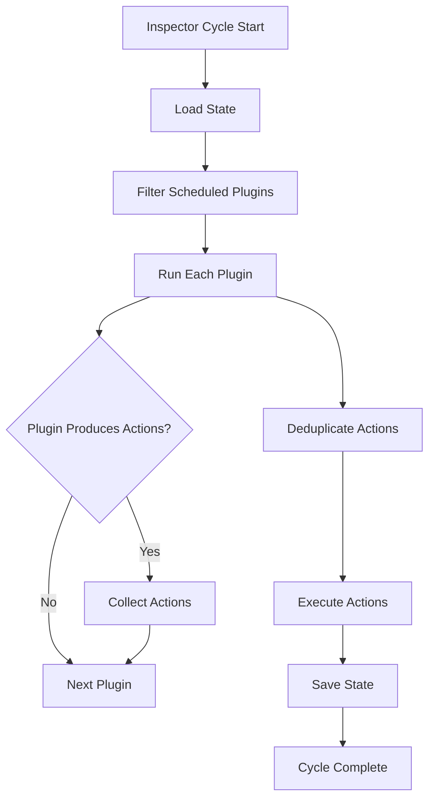
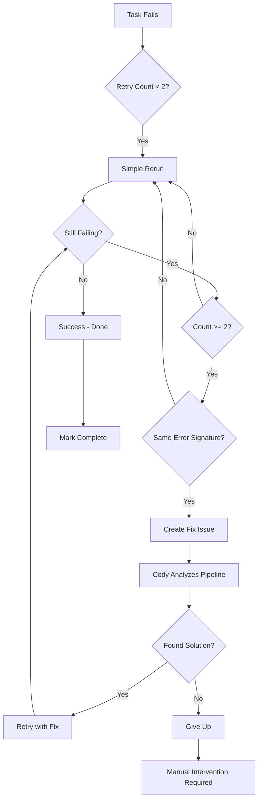
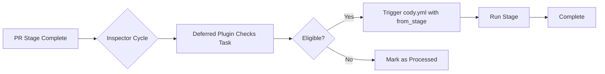
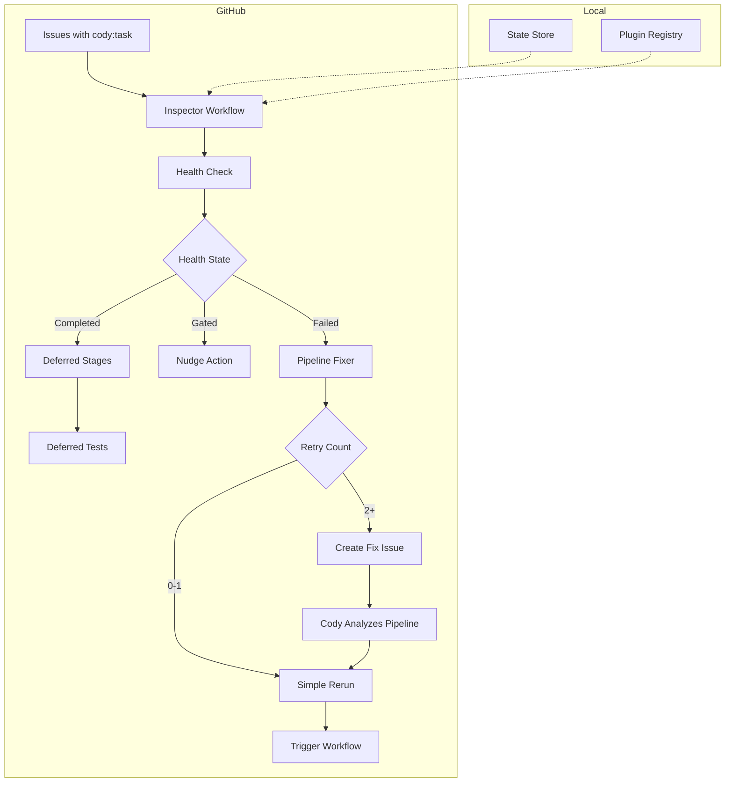
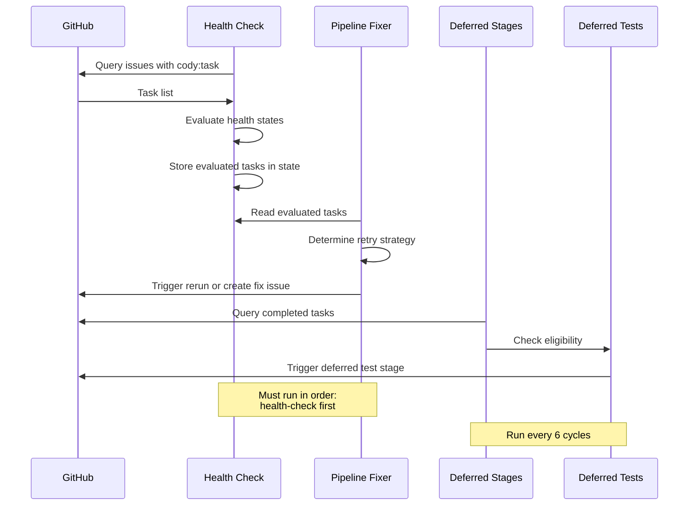

# Cody Pipeline Health Monitoring Architecture

This document describes the Inspector plugin framework and its health monitoring capabilities for the Cody pipeline system.

## Overview

The Inspector is an autonomous monitoring system that continuously watches over the Cody pipeline, detecting failures, managing retries, and ensuring pipeline health. It runs as a scheduled GitHub Actions workflow that executes every 5 minutes, evaluating each active task and taking corrective actions when necessary.

### Inspector Plugin Framework

The Inspector is built on a plugin-based architecture that allows independent health-checking and remediation modules to run in sequence. The framework is defined in `scripts/inspector/` and consists of:

- **Core Engine** (`scripts/inspector/core/inspector.ts`): Orchestrates plugin execution, deduplication, and action execution
- **Plugin Registry** (`scripts/inspector/plugins/registry.ts`): Manages plugin registration and discovery
- **Type Definitions** (`scripts/inspector/core/types.ts`): Common types for all plugins
- **State Store** (`scripts/inspector/core/state.ts`): Persists state between cycles

### Plugin Architecture

Each plugin implements the `InspectorPlugin` interface with the following structure:

```typescript
interface InspectorPlugin {
  name: string
  description: string
  domain: string
  schedule?: { every?: number; onlyBetween?: { start: string; end: string } }
  run(ctx: InspectorContext): Promise<ActionRequest[]>
}
```

Plugins can be scheduled to run on specific cycles using the `schedule.every` property. This allows resource-intensive plugins to run less frequently while critical health checks run every cycle.

### Plugin Execution Flow



## Health Check Plugins

### 1. Health Check Plugin (`cody-health-check`)

**Location**: `scripts/inspector/plugins/cody/health-check/index.ts`

The health-check plugin is the primary monitoring component that evaluates the health of each active Cody task. It discovers all tasks with the `cody:task` label and evaluates their current state.

#### Health States

The plugin assigns one of the following health states to each task:

| State | Description |
|-------|-------------|
| `healthy` | Pipeline running normally with progress within 20 minutes |
| `stalled` | No progress for 20+ minutes but workflow still running |
| `orphaned` | Workflow terminated but status.json still shows running |
| `failed` | Pipeline failed or timed out at a specific stage |
| `gated` | Pipeline paused waiting for human approval |
| `completed` | Pipeline finished successfully |
| `unknown` | No status.json found or invalid state |

#### Task Discovery

Tasks are discovered by querying GitHub issues with the `cody:task` label. For each task, the plugin reads the `status.json` file from the task's branch to determine the current state.

#### Actions Produced

- **Nudge Action**: Posts a comment on gated tasks that have been waiting for 30+ minutes, asking for approval
- **Digest Action**: Posts a daily summary to a designated digest issue showing all task health states

### 2. Queue Manager Plugin (`cody-queue-manager`)

**Location**: `scripts/inspector/plugins/cody/queue-manager/index.ts`

The queue manager ensures only one task runs at a time by monitoring the active queue state. It prevents resource conflicts and ensures orderly pipeline execution.

#### Responsibilities

- Tracks the currently active task in state
- Prevents multiple tasks from running simultaneously
- Manages queue transitions when tasks complete or fail

### 3. Success Tracker Plugin (`cody-success-tracker`)

**Location**: `scripts/inspector/plugins/cody/success-tracker/index.ts`

Tracks pipeline success metrics over time, collecting data on:
- Success rate by stage
- Average execution time
- Failure patterns

This data is used to identify systemic issues and measure pipeline improvements.

### 4. Failure Miner Plugin (`cody-failure-miner`)

**Location**: `scripts/inspector/plugins/cody/failure-miner/index.ts`

Analyzes failed tasks to extract actionable insights:
- Identifies common failure patterns
- Categorizes errors by type
- Generates reports for pipeline improvements

### 5. Zombie Reaper Plugin (`cody-zombie-reaper`)

**Location**: `scripts/inspector/plugins/cody/zombie-reaper/index.ts`

Detects and cleans up orphaned workflow runs that have terminated but still appear active. This prevents resource waste and ensures accurate health reporting.

### 6. Audit Plugin (`cody-audit`)

**Location**: `scripts/inspector/plugins/cody/audit/index.ts`

Performs periodic audits of pipeline state and creates issues for:
- Tasks stuck in invalid states
- Missing required files
- Configuration inconsistencies

## Pipeline Fixer Retry Strategy

**Location**: `scripts/inspector/plugins/cody/pipeline-fixer/index.ts`

The pipeline-fixer plugin implements an intelligent retry strategy that escalates from simple reruns to full pipeline fixes.

### Retry Flow



### Retry Phases

#### Phase 1: Simple Retries (Retries 0-1)

- Trigger workflow rerun from the failed stage
- Pass the error message as feedback to the next run
- No pipeline code changes

#### Phase 2: Fix Issue Creation (Retry 2+)

When a task fails with the same error twice:
1. Create a GitHub issue describing the failure
2. Include stage output, error message, and retry history
3. Trigger `@cody` on the fix issue
4. Cody analyzes the pipeline code and proposes fixes

#### Phase 3: Post-Fix Retries (Retries 3-5)

After a fix issue is resolved:
1. Retry the original task with potentially fixed pipeline code
2. Continue with remaining retry attempts
3. Give up after 5 total attempts

### Retry Configuration

```typescript
const MAX_RETRIES = 5           // Maximum retry attempts
const FIX_ISSUE_THRESHOLD = 2   // Create fix issue after 2 failures
const DEDUP_WINDOW_MINUTES = 15 // Prevent duplicate retries
```

### Non-Retryable Errors

Certain errors are not retried as they indicate infrastructure problems:

- API key / authentication failures
- Disk space issues (`ENOSPC`, `no space left`)
- These are flagged for manual intervention immediately

### Cross-Task Deduplication

Before creating a fix issue, the plugin checks if another task already created a fix issue for the same stage failure. If so, it links the task to the existing issue instead of creating duplicates.

## Deferred Test and Docs Stages

### Why Deferred?

The live pipeline was optimized to reduce execution time by removing two time-consuming stages:

1. **Test Writing**: Could add ~200 minutes in worst-case fix loops
2. **Docs Generation**: Added 2-5 minutes and 1 LLM call per run

These stages are now handled by Inspector plugins that run after the main pipeline completes.

### Deferred Stages Plugin

**Location**: `scripts/inspector/plugins/cody/deferred-stages/index.ts`

Runs the `docs` stage for tasks that:
- Completed the `pr` stage (pipeline finished)
- Did not complete the `docs` stage
- Have `docs.md` file missing
- Have complexity ≥ 30 (matching the review threshold)

#### Configuration

```typescript
const DOCS_COMPLEXITY_THRESHOLD = 30  // Minimum complexity for docs
schedule: { every: 6 }                // Run every 6 cycles (~30 min)
```

### Deferred Tests Plugin

**Location**: `scripts/inspector/plugins/cody/deferred-tests/index.ts`

Writes tests for tasks that:
- Completed the `pr` stage
- Did not complete the `test` stage
- Have `test.md` file missing
- Are less than 7 days old (staleness guard)

#### Key Differences from Docs

- **No complexity threshold**: Every task gets tests
- **Staleness guard**: Skips tasks older than 7 days
- **Feedback message**: "Deferred test run: write tests for the implemented code on dev. Create a new test branch."

### Execution Flow



## Architecture Diagram

### Complete System Overview



### Plugin Interaction Diagram



## Troubleshooting Guide

### Common Failure Modes

#### 1. Task Stuck in "Running" State

**Symptoms**: Status shows "running" for >20 minutes with no progress

**Possible Causes**:
- Workflow crashed without updating status.json
- Network timeout during stage execution
- GitHub Actions resource constraints

**Resolution**:
1. Inspector detects staleness after 20 minutes
2. Checks if workflow run still exists
3. If orphaned: marks as `orphaned`, triggers retry
4. If stalled: marks as `stalled`, may trigger retry after extended time

#### 2. Repeated Failures at Same Stage

**Symptoms**: Task fails at `build` stage multiple times with same error

**Possible Causes**:
- Missing dependency in build environment
- Code change that breaks build
- Payload CMS version mismatch

**Resolution**:
1. After 2 failures, pipeline-fixer creates a fix issue
2. Cody analyzes the failure and proposes pipeline fixes
3. Fix is applied to pipeline code
4. Task retried with fixed pipeline

#### 3. Gate Timeout

**Symptoms**: Task shows "gated" status for >30 minutes

**Possible Causes**:
- Reviewer not available
- Manual approval forgotten
- Weekend/holiday delay

**Resolution**:
1. Inspector posts nudge comment after 30 minutes
2. Additional nudges at 60 minutes (critical urgency)
3. Manual intervention required if not resolved

#### 4. Disk Space Errors

**Symptoms**: Error message contains "ENOSPC" or "no space left"

**Possible Causes**:
- Large build artifacts not cleaned up
- Database growth
- Temporary files accumulating

**Resolution**:
- Marked as non-retryable immediately
- Requires manual environment cleanup
- Postmortem to prevent recurrence

#### 5. Authentication Failures

**Symptoms**: Error contains "API key" or "_api_key"

**Possible Causes**:
- Expired GitHub token
- Missing environment variable
- Rotated credentials

**Resolution**:
- Marked as non-retryable
- Requires manual credential update
- Check GitHub Actions secrets

### Debugging Commands

```bash
# Check task status
gh run list --workflow=cody.yml --branch=feat/<task-id>

# View task logs
gh run view <run-id> --log

# Check Inspector state
cat .inspector/state.json | jq

# Manually trigger retry
gh workflow run cody.yml -f task_id=<task-id> -f mode=rerun -f from_stage=build
```

### Inspector Configuration

The Inspector is configured via environment variables:

| Variable | Required | Description |
|----------|----------|-------------|
| `REPO` | Yes | GitHub repository (owner/repo) |
| `GH_TOKEN` | Yes | GitHub token for API access |
| `GH_PAT` | No | Personal access token for workflow dispatch |
| `INSPECTOR_DIGEST_ISSUE` | No | Issue number for daily digest |
| `DRY_RUN` | No | If "true", don't execute actions |
| `LOG_LEVEL` | No | Logging level (default: info) |
| `SLACK_WEBHOOK_URL` | No | Slack webhook for notifications |
| `MINIMAX_API_KEY` | No | API key for audit plugin AI analysis |

## File Reference

| Component | Path |
|-----------|------|
| Inspector Entry Point | `scripts/inspector/index.ts` |
| Core Engine | `scripts/inspector/core/inspector.ts` |
| Plugin Registry | `scripts/inspector/plugins/registry.ts` |
| Type Definitions | `scripts/inspector/core/types.ts` |
| Health Check Plugin | `scripts/inspector/plugins/cody/health-check/index.ts` |
| Pipeline Fixer Plugin | `scripts/inspector/plugins/cody/pipeline-fixer/index.ts` |
| Deferred Stages Plugin | `scripts/inspector/plugins/cody/deferred-stages/index.ts` |
| Deferred Tests Plugin | `scripts/inspector/plugins/cody/deferred-tests/index.ts` |
| Queue Manager Plugin | `scripts/inspector/plugins/cody/queue-manager/index.ts` |
| Success Tracker Plugin | `scripts/inspector/plugins/cody/success-tracker/index.ts` |
| Failure Miner Plugin | `scripts/inspector/plugins/cody/failure-miner/index.ts` |
| Zombie Reaper Plugin | `scripts/inspector/plugins/cody/zombie-reaper/index.ts` |
| Audit Plugin | `scripts/inspector/plugins/cody/audit/index.ts` |
| GitHub Client | `scripts/inspector/clients/github.ts` |
| Slack Client | `scripts/inspector/clients/slack.ts` |

## Conclusion

The Inspector framework provides autonomous health monitoring and remediation for the Cody pipeline. By separating health checking from the main pipeline, it reduces execution time while ensuring tasks still receive proper test coverage and documentation generation. The plugin-based architecture allows for easy extension and customization of monitoring behavior.

Key benefits:
- **Reduced latency**: Health issues detected within 5 minutes
- **Automated recovery**: Most failures handled without human intervention
- **Deferred work**: Time-consuming stages moved to background processing
- **Observable**: Digest reports provide visibility into pipeline health
