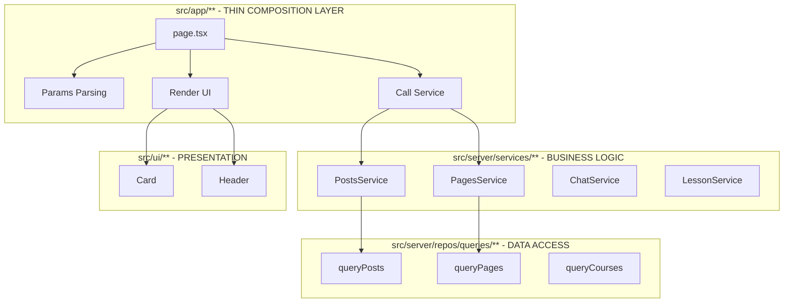

# Thin App Layer Refactoring Plan

**Goal:** Turn `src/app/**` into a thin composition layer only: routing + minimal orchestration.

---

## Step 0: Slug Resolution Audit (Pre-Step)

Before creating new repos, inspect `src/app/(frontend)/[slug]/page.tsx`:

- What does `[slug]` represent? Page only / Post only / polymorphic?
- Decision: `[slug]` is for Pages only (Posts use `/posts/[slug]`)
- Create `repos/queries/pages.ts` for Pages queries

---

## Strict Rules

### Allowed Imports by File Type (Enforced by ESLint)

#### SSR Pages/Layout: `src/app/**/{page,layout}.tsx`

**Allowed:**

```
✅ @/server/services/**          - Preferred for business logic
✅ @/server/repos/queries/**     - ONLY read-only single-call queries
✅ @/ui/**                       - UI components
✅ next/*                        - Navigation, headers
```

**Forbidden:**

```
❌ Direct Payload (`payload`, `@/server/payload/**`)
❌ Repos outside `/queries/**`
❌ @/infra/llm/**, @/infra/pdfjs/**, @/infra/analytics/**
```

**Policy:** Max 1 query call per SSR page unless via service (review-blocking).

#### Route Handlers: `src/app/**/route.ts`

**Allowed:**

```
✅ @/server/services/**          - ONLY allowed
✅ next/server, next/headers     - Minimal Next utilities
```

**Forbidden:**

```
❌ @/server/repos/**             - All repos forbidden
❌ Direct Payload (`payload`)
❌ @/server/payload/**
❌ @/infra/llm/**, @/infra/pdfjs/**, @/infra/analytics/**
```

#### Server Actions: `src/app/**/actions/**`

**Convention:** `'use server'` allowed ONLY in `src/app/**/actions/**`.

**Allowed:**

```
✅ @/server/services/**          - ONLY allowed
✅ next/server, next/headers
```

**Forbidden:**

```
❌ @/server/repos/**             - All repos forbidden
❌ Direct Payload
❌ @/infra/llm/**, @/infra/pdfjs/**, @/infra/analytics/**
```

#### File Structure Allowlist for `src/app/**`

**Allowed files (no extra TS/TSX outside these):**

- `{page,layout,loading,error,not-found}.tsx`
- `route.ts`
- `actions/**`
- `_components/**` (for colocated UI components only)

**Forbidden:**

```
❌ src/app/**/{lib,utils,helpers}/
❌ Any .ts/.tsx file outside allowed list
```

### Heavy Transform Definition (Violations)

A file violates Thin App Layer if it contains any of:

- `.map`, `.filter`, `.reduce`, `.sort` on query results
- Building view models / DTO shaping beyond trivial pick
- Merging results from multiple queries
- Decision trees / routing decisions / permission rules

**If any exists → move logic to `src/server/services/**`.\*\*

---

## Current Violations Found

### Phase 2 Completed ✅ (SSR Pages → Repos)

| File                                       | Status   |
| ------------------------------------------ | -------- |
| `src/app/(frontend)/[slug]/page.tsx`       | ✅ Fixed |
| `src/app/(frontend)/search/page.tsx`       | ✅ Fixed |
| `src/app/(frontend)/posts/page.tsx`        | ✅ Fixed |
| `src/app/(frontend)/posts/[slug]/page.tsx` | ✅ Fixed |

### Phase 3 Pending 🚧 (Route Handlers → Services)

| File                                                            | Violation Type | Service Needed                             |
| --------------------------------------------------------------- | -------------- | ------------------------------------------ |
| `src/app/api/oauth/google/callback/route.ts`                    | Direct Payload | `oauth-service.ts`                         |
| `src/app/api/oauth/google/callback/oauth_callback_helpers.ts`   | Direct Payload | `oauth-service.ts`                         |
| `src/app/api/chapters/by-grade/route.ts`                        | Direct Payload | `chapters-service.ts` (uses existing repo) |
| `src/app/api/agent/chat/route.ts`                               | Direct Payload | `chat-service.ts`                          |
| `src/app/api/agent/reset-chat/route.ts`                         | Direct Payload | `chat-service.ts`                          |
| `src/app/api/agent/conversation/route.ts`                       | Direct Payload | `conversation-service.ts`                  |
| `src/app/api/exercises/import/route.ts`                         | Direct Payload | `exercise-import-service.ts`               |
| `src/app/(frontend)/next/seed/route.ts`                         | Direct Payload | `seed-service.ts`                          |
| `src/app/(frontend)/next/preview/route.ts`                      | Direct Payload | `preview-service.ts`                       |
| `src/app/(frontend)/actions/auth-action.ts`                     | Direct Payload | `auth-service.ts`                          |
| `src/app/(frontend)/signup/actions/signup_createUser-action.ts` | Direct Payload | `auth-service.ts`                          |
| `src/app/(frontend)/login/login_authenticate-action.ts`         | Direct Payload | `auth-service.ts`                          |
| `src/app/(frontend)/(sitemaps)/posts-sitemap.xml/route.ts`      | Direct Payload | Use `queryPublishedPosts` repo             |
| `src/app/(frontend)/(sitemaps)/pages-sitemap.xml/route.ts`      | Direct Payload | Use `queryPublishedPages` repo             |
| `src/app/(frontend)/posts/page/[pageNumber]/page.tsx`           | Direct Payload | Use `queryPublishedPosts` repo             |
| `src/app/(frontend)/exercises/[id]/page.tsx`                    | Direct Payload | Use `queryExerciseById` repo               |
| `src/app/(payload)/layout.tsx`                                  | Direct Payload | Use `getPayload` from config               |

### Phase 4 Pending 🚧 (Client Components → Services)

| File                              | Violation Type    | Fix                            |
| --------------------------------- | ----------------- | ------------------------------ |
| `ChatInterface/index.tsx`         | @/infra/llm       | Move to `chat-service.ts`      |
| `NotebookChat/index.tsx`          | @/infra/llm       | Move to `chat-service.ts`      |
| `NotebookChat/useNotebookChat.ts` | @/infra/llm       | Move to `chat-service.ts`      |
| `NotebookChat/useNotebookChat.ts` | @/infra/analytics | Move to `analytics-service.ts` |
| `api/pdfjs-viewer/route.ts`       | @/infra/pdfjs     | Move to `pdfjs-service.ts`     |
| `LessonAnalytics.tsx`             | @/infra/analytics | Move to `analytics-service.ts` |
| `CourseAnalytics.tsx`             | @/infra/analytics | Move to `analytics-service.ts` |
| `SignupForm.tsx`                  | @/infra/analytics | Move to `analytics-service.ts` |
| `LayoutClient.tsx`                | @/infra/analytics | Move to `analytics-service.ts` |

### Convention Violations 🚧 (Fix immediately)

| File                                                    | Issue                          |
| ------------------------------------------------------- | ------------------------------ |
| `src/app/(frontend)/login/login_authenticate-action.ts` | 'use server' outside /actions/ |
| `src/app/(payload)/layout.tsx`                          | 'use server' outside /actions/ |

---

## Architecture Diagram



---

## Refactoring Tasks

### Phase 1: Create Domain Repos (SSR Pages Only)

#### 1.1 Create `src/server/repos/queries/pages.ts`

```typescript
export const queryPageBySlug = cache(async ({ slug }: { slug: string }))
export const queryPublishedPages = cache(async ())
```

#### 1.2 Create `src/server/repos/queries/posts.ts`

```typescript
export const queryPostBySlug = cache(async ({ slug }: { slug: string }))
export const queryPublishedPosts = cache(async ({ limit, page }))
export const searchPosts = cache(async ({ query, limit }))
```

### Phase 2: Refactor Pages (SSR Pages Only)

#### 2.1 `src/app/(frontend)/[slug]/page.tsx`

**Before:** Direct Payload
**After:** Use `queryPageBySlug` from `@/server/repos/queries/pages`

#### 2.2 `src/app/(frontend)/search/page.tsx`

**Before:** Direct Payload with search logic
**After:** Use `searchPosts` from `@/server/repos/queries/posts`

#### 2.3 `src/app/(frontend)/posts/page.tsx`

**Before:** Direct Payload
**After:** Use `queryPublishedPosts` from `@/server/repos/queries/posts`

#### 2.4 `src/app/(frontend)/posts/[slug]/page.tsx`

**Before:** Direct Payload
**After:** Use `queryPostBySlug` from `@/server/repos/queries/posts`

### Phase 3: Create Domain Services (Route Handlers Only)

#### 3.1 Create `src/server/services/chat-service.ts`

```typescript
export async function chat(message: string, context: Context): Promise<Result>
export async function getConversation(contextKey: string): Promise<Result>
export async function resetChat(contextKey: string): Promise<Result>
```

#### 3.2 Create `src/server/services/conversation-service.ts`

```typescript
export async function getConversation(context: RequestContext): Promise<Response>
```

#### 3.3 Extend `src/server/services/oauth-service.ts`

```typescript
export async function handleGoogleCallback(request: NextRequest): Promise<Response>
```

### Phase 4: Refactor Route Handlers

#### 4.1 `src/app/api/agent/chat/route.ts`

**Before:** Direct Payload + inline validation
**After:** Call `chatService.chat()`

#### 4.2 `src/app/api/agent/conversation/route.ts`

**Before:** Direct Payload
**After:** Call `conversationService.get()`

#### 4.3 OAuth callback routes

**Before:** Inline OAuth handling
**After:** Call `oauthService.handleGoogleCallback()`

### Phase 5: Extract Heavy Transforms

#### 5.1 `src/app/(frontend)/courses/.../lessons/[lessonSlug]/page.tsx`

**Before:** Inline `validFiles` mapping
**After:** Call `lessonService.extractValidContentFiles(lesson)`

#### 5.2 `src/app/(frontend)/.../NotebookChat/useNotebookChat.ts`

**Split approach:**

- UI-only normalization → `src/client/**` helpers
- Canonical server decisions (permissions, persistence, retrieval) → `src/server/services/**`
- `useNotebookChat.ts` stays client hook; may call API route, must NOT embed business rules

---

## Phase X: Enforcement (Mandatory)

### X.1 ESLint Rules

**A. Block direct Payload in `src/app/**`\*\*

```javascript
{
  files: ['src/app/**/*.{ts,tsx}'],
  plugins: ['import'],
  rules: {
    'no-restricted-imports': [
      'error',
      {
        patterns: [
          'payload',
          { name: 'payload', importNames: ['default', 'getPayload'] },
          '@/server/payload/**',
          '@/collections/**',
          '@/fields/**',
          '@/access/**',
          '@payloadcms/**',
        ],
      },
    ],
  },
}
```

**B. Block repos in routes/actions (glob-scoped)**

```javascript
{
  files: ['src/app/**/route.ts', 'src/app/**/actions/**'],
  rules: {
    'no-restricted-imports': [
      'error',
      {
        patterns: [{ pattern: '@/server/repos/**' }],
        message: 'Route handlers and server actions must call services only',
      },
    ],
  },
}
```

**C. Block heavy transforms (map/filter/reduce/sort)**

```javascript
{
  files: ['src/app/**/*.{ts,tsx}'],
  excludedFiles: [
    'src/app/**/loading.tsx',
    'src/app/**/error.tsx',
    'src/app/**/not-found.tsx',
  ],
  rules: {
    'no-restricted-syntax': [
      'error',
      {
        // Match: array.map(), array.filter(), array.reduce(), array.sort()
        selector: 'CallExpression[callee.type="MemberExpression"][callee.property.name=/^(map|filter|reduce|sort)$/]',
        message: 'Heavy transforms forbidden. Move to src/server/services/**.',
      },
    ],
  },
}
```

### X.2 CI Grep Guard

Add CI step scanning `src/app/**`:

```bash
# Direct Payload usage (fail)
find src/app -type f \( -name "*.ts" -o -name "*.tsx" \) -exec grep -l "getPayload" {} + && exit 1
find src/app -type f \( -name "*.ts" -o -name "*.tsx" \) -exec grep -l "from 'payload'" {} + && exit 1
find src/app -type f \( -name "*.ts" -o -name "*.tsx" \) -exec grep -l "from '@/server/payload/" {} + && exit 1
find src/app -type f \( -name "*.ts" -o -name "*.tsx" \) -exec grep -l "from '@payloadcms/" {} + && exit 1

# Repos in routes/actions (fail)
grep -r "from '@/server/repos/" src/app --include="*route.ts" && exit 1
grep -r "from '@/server/repos/" src/app --include="*actions*" && exit 1

# Forbidden infra domains (fail)
find src/app -type f \( -name "*.ts" -o -name "*.tsx" \) -exec grep -l "@/infra/llm" {} + && exit 1
find src/app -type f \( -name "*.ts" -o -name "*.tsx" \) -exec grep -l "@/infra/pdfjs" {} + && exit 1
find src/app -type f \( -name "*.ts" -o -name "*.tsx" \) -exec grep -l "@/infra/analytics" {} + && exit 1

# Structure guard: extra directories (fail)
find src/app -type d \( -name lib -o -name utils -o -name helpers \) | grep -q . && exit 1

# Server action convention: 'use server' ONLY in /actions/ (fail)
USE_SERVER_FILES=$(find src/app -type f \( -name "*.ts" -o -name "*.tsx" \) -exec grep -l "'use server'" {} +)
for f in $USE_SERVER_FILES; do
  if ! echo "$f" | grep -E "src/app/.*/actions/" > /dev/null; then
    echo "ERROR: 'use server' found outside /actions/: $f"
    exit 1
  fi
done
```

### X.3 README Guardrail

Create `src/app/README.md`:

```markdown
# Thin App Layer

**Routes + Actions import ONLY:** `@/server/services/**`
**SSR pages import ONLY:** `@/ui/**`, `next/*`, `@/server/services/**`, `@/server/repos/queries/**`

**Forbidden:**

- Direct Payload access
- Business rules / decisions
- Heavy transforms (map/filter/reduce)
- Orchestration logic
- LLM/PDF/analytics logic

**Rule:** If it makes a decision → it does NOT belong in `app`.
```

---

## File Movement Summary

### Phase 1-2 Completed ✅

| Source                   | Destination                                           |
| ------------------------ | ----------------------------------------------------- |
| Inline `queryPageBySlug` | `src/server/repos/queries/pages.ts`                   |
| Inline search logic      | `src/server/repos/queries/posts.ts` + `searchPosts()` |
| Inline `queryPostBySlug` | `src/server/repos/queries/posts.ts`                   |

### Phase 3 Pending 🚧 (Route Handlers → Services)

| Source                                   | Destination                                      |
| ---------------------------------------- | ------------------------------------------------ |
| `api/agent/chat/route.ts` business logic | `src/server/services/chat-service.ts`            |
| `api/agent/reset-chat/route.ts`          | `src/server/services/chat-service.ts`            |
| `api/agent/conversation/route.ts` logic  | `src/server/services/conversation-service.ts`    |
| `api/oauth/google/callback/**`           | `src/server/services/oauth-service.ts`           |
| `api/chapters/by-grade/route.ts`         | `src/server/services/chapters-service.ts`        |
| `api/exercises/import/route.ts`          | `src/server/services/exercise-import-service.ts` |
| `(frontend)/next/seed/route.ts`          | `src/server/services/seed-service.ts`            |
| `(frontend)/next/preview/route.ts`       | `src/server/services/preview-service.ts`         |
| `actions/auth-action.ts`                 | `src/server/services/auth-service.ts`            |
| `signup/createUser-action.ts`            | `src/server/services/auth-service.ts`            |
| `login/auth-action.ts`                   | `src/server/services/auth-service.ts`            |

### Phase 4 Pending 🚧 (Pages → Repos/Services)

| Source                                        | Destination                                                 |
| --------------------------------------------- | ----------------------------------------------------------- |
| `(frontend)/posts/page/[pageNumber]/page.tsx` | `queryPublishedPosts` from `@/server/repos/queries/posts`   |
| `(frontend)/exercises/[id]/page.tsx`          | `queryExerciseById` from `@/server/repos/queries/exercises` |
| `(sitemaps)/posts-sitemap.xml/route.ts`       | `queryPublishedPosts` from `@/server/repos/queries/posts`   |
| `(sitemaps)/pages-sitemap.xml/route.ts`       | `queryPublishedPages` from `@/server/repos/queries/pages`   |
| `(payload)/layout.tsx`                        | Use `getPayload` from config in `src/payload/`              |

### Phase 5 Pending 🚧 (Infra → Services)

| Source                                  | Destination                                         |
| --------------------------------------- | --------------------------------------------------- |
| `ChatInterface/index.tsx` (@/infra/llm) | `src/server/services/chat-service.ts`               |
| `NotebookChat/index.tsx` (@/infra/llm)  | `src/server/services/chat-service.ts`               |
| `NotebookChat/useNotebookChat.ts`       | Client → service, `@/infra/llm` → `chat-service.ts` |
| `NotebookChat/useNotebookChat.ts`       | `@/infra/analytics` → `analytics-service.ts`        |
| `api/pdfjs-viewer/route.ts`             | `src/server/services/pdfjs-service.ts`              |

### New Repos Required

| File                                    | Exports                |
| --------------------------------------- | ---------------------- |
| `src/server/repos/queries/chapters.ts`  | `queryChaptersByGrade` |
| `src/server/repos/queries/exercises.ts` | `queryExerciseById`    |

### New Services Required

| File                                             | Exports                                        |
| ------------------------------------------------ | ---------------------------------------------- |
| `src/server/services/auth-service.ts`            | `login`, `signup`, `authenticate`              |
| `src/server/services/chat-service.ts`            | `sendMessage`, `resetChat`, `getConversation`  |
| `src/server/services/conversation-service.ts`    | `getConversationByContext`                     |
| `src/server/services/oauth-service.ts`           | `handleGoogleCallback`                         |
| `src/server/services/chapters-service.ts`        | `getChaptersByGrade`                           |
| `src/server/services/exercise-service.ts`        | `getExerciseById`                              |
| `src/server/services/exercise-import-service.ts` | `importExercises`                              |
| `src/server/services/seed-service.ts`            | `seedDatabase`                                 |
| `src/server/services/preview-service.ts`         | `getPreviewData`                               |
| `src/server/services/sitemap-service.ts`         | `generatePostsSitemap`, `generatePagesSitemap` |
| `src/server/services/pdfjs-service.ts`           | `getPdfViewerData`                             |
| `src/server/services/analytics-service.ts`       | `trackEvent`, `getAnalyticsData`               |

---

## Validation Checklist

### Step 0: Audit ✅

- [x] Step 0 completed: Slug resolution decision documented

### Phase 1: Domain Repos ✅

- [x] Created `src/server/repos/queries/pages.ts`
- [x] Created `src/server/repos/queries/posts.ts`

### Phase 2: SSR Pages ✅

- [x] `src/app/(frontend)/[slug]/page.tsx` - uses `queryPageBySlug`
- [x] `src/app/(frontend)/search/page.tsx` - uses `searchPosts`
- [x] `src/app/(frontend)/posts/page.tsx` - uses `queryPublishedPosts`
- [x] `src/app/(frontend)/posts/[slug]/page.tsx` - uses `queryPostBySlug`

### Phase 3: Route Handlers (Pending) 🚧

- [ ] Create `auth-service.ts` for login/signup/auth-action
- [ ] Create `chat-service.ts` for chat/reset-chat/conversation
- [ ] Create `conversation-service.ts`
- [ ] Create `oauth-service.ts` for Google callback
- [ ] Create `chapters-service.ts`
- [ ] Create `exercise-import-service.ts`
- [ ] Create `seed-service.ts`
- [ ] Create `preview-service.ts`
- [ ] Create `sitemap-service.ts`
- [ ] Create `exercise-service.ts` + `exercises.ts` repo
- [ ] Refactor all route handlers to use services

### Phase 4: Pages (Pending) 🚧

- [ ] `src/app/(frontend)/posts/page/[pageNumber]/page.tsx` - use repo
- [ ] `src/app/(frontend)/exercises/[id]/page.tsx` - use repo
- [ ] `src/app/(frontend)/(sitemaps)/posts-sitemap.xml/route.ts` - use repo
- [ ] `src/app/(frontend)/(sitemaps)/pages-sitemap.xml/route.ts` - use repo
- [ ] `src/app/(payload)/layout.tsx` - use `getPayload` from config

### Phase 5: Infra (Pending) 🚧

- [ ] Move `@/infra/llm` from ChatInterface/NotebookChat to service
- [ ] Move `@/infra/analytics` to `analytics-service.ts`
- [ ] Move `@/infra/pdfjs` to `pdfjs-service.ts`

### Phase X: Enforcement ✅

- [x] ESLint rules added
- [x] CI grep guard added
- [x] README created at `src/app/README.md`

### Test Coverage ✅

- [x] Created `tests/unit/queries/pages.test.ts` (8 tests)
- [x] Created `tests/unit/queries/posts.test.ts` (11 tests)
- [x] Renamed `exercises.unit.spec.ts` → `exercises.test.ts` (6 tests)
- [x] All 25 repo tests pass

### Convention Fixes (Pending) 🚧

- [ ] Move `login_authenticate-action.ts` to `/actions/` subdirectory
- [ ] Remove 'use server' from `(payload)/layout.tsx` or move to appropriate location

## Validation Checklist

- [x] Step 0 completed: Slug resolution decision documented
- [x] SSR pages use only `@/server/repos/queries/*` (read-only, no heavy transforms)
- [ ] Route handlers use only `@/server/services/*`
- [ ] No direct `getPayload()` calls in `src/app/**`
- [ ] No `map/filter/reduce/sort` on query results in `src/app/**`
- [ ] No building view models in `src/app/**`
- [x] Phase X: ESLint rules added
- [x] Phase X: CI grep guard added
- [x] Phase X: README created at `src/app/README.md`
- [x] All tests pass (25/25)
